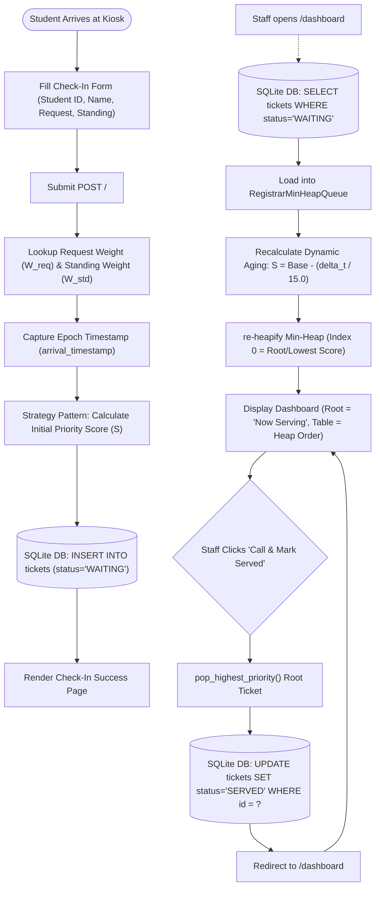
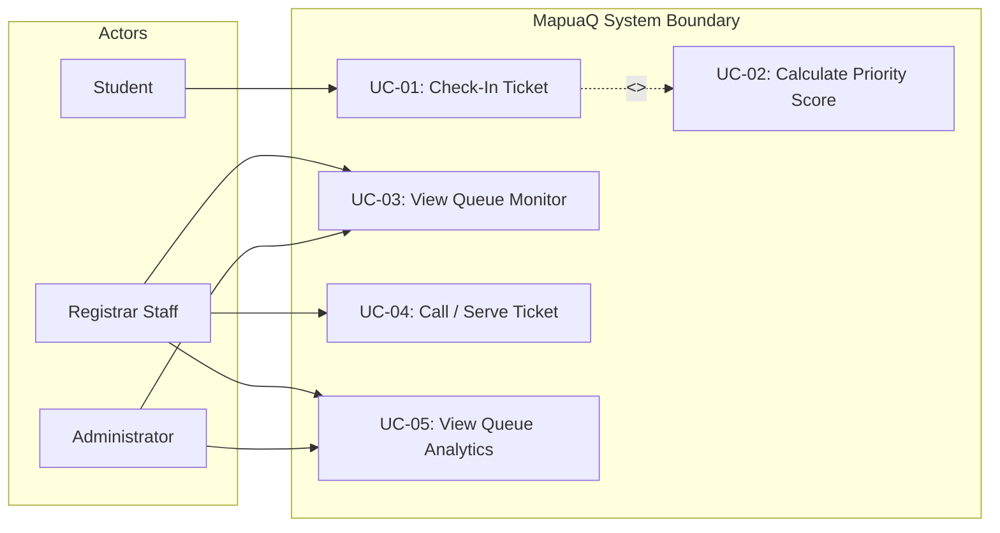
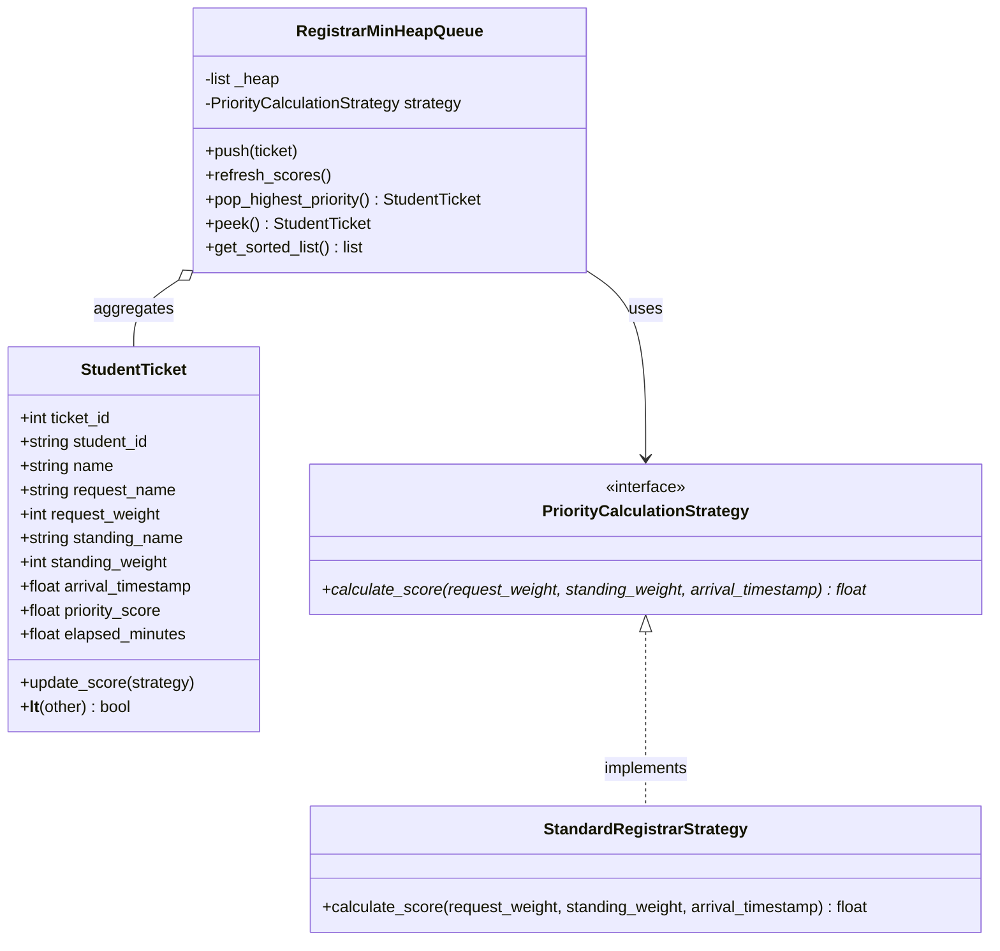
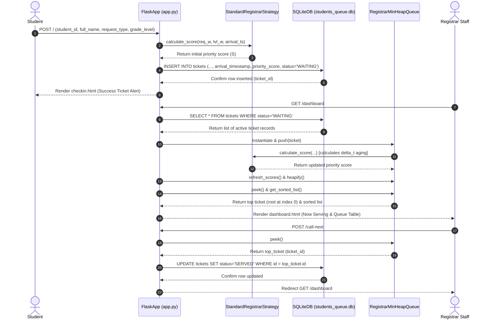
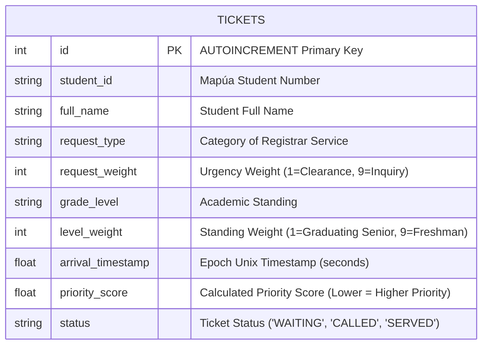

# MapuaQ: A Priority-Based Student Queuing System Using Min-Heap Algorithm and Dynamic Priority Aging

**Course Code & Section:** CPE106L-4 / Section B2 (Software Design Laboratory)  
**Institution:** Mapúa University, School of Artificial Intelligence, Electrical, Computer, and Electronics Engineering (AIECEE)  
**Instructor:** Dr. John De Guzman Tarampi  
**Academic Term:** 1st Term, AY 2026-2027  

**Project Team & Specialized Roles (Team of 4):**
- **Justin Andre De Leon** — Lead Software Architect & Core Backend Developer  
  *Responsibilities: System design, Flask web routing architecture, Strategy Design Pattern implementation, and overall integration.*
- **Hannah Grace Duldulao** — Algorithm & Queueing Specialist  
  *Responsibilities: Binary Min-Heap mechanics (`heap_queue.py`), dynamic priority aging formula implementation, priority weighting matrix, and tie-breaking algorithms.*
- **Matt Eugene Hilado** — Data Engineer & UI/UX Designer  
  *Responsibilities: SQLite database schema (`schema.sql`), timestamp persistence, Bootstrap 5 templates (`checkin.html`, `dashboard.html`, `analytics.html`), and Matplotlib analytics integration (`analytics.py`).*
- **Wilhelm Ferrer** — Systems Analyst & QA Lead  
  *Responsibilities: GitHub Kanban backlog management, `unittest` AAA test suites (`test_heap.py`, `test_app.py`), software quality assurance, and sprint documentation.*

---

## 1. Executive Summary

**MapuaQ** is an algorithmic, web-based student priority queuing system designed for the Mapúa University Registrar Office. Traditional First-Come, First-Served (FCFS) queuing mechanisms fail during peak academic periods because routine inquiries block time-sensitive institutional requests (such as graduation clearances and subject dropping deadlines). Conversely, static priority queues introduce severe **queue starvation**, where lower-priority tickets are repeatedly preempted by incoming higher-priority tickets and never served.

MapuaQ resolves both operational challenges by integrating an in-memory **Binary Min-Heap** data structure ($O(\log N)$ insertions/deletions and $O(1)$ root lookup) with **Dynamic Priority Aging**. Utilizing the **Strategy Design Pattern**, MapuaQ evaluates priority scores based on a weighted formula ($60\%$ service request urgency and $40\%$ academic standing) while continuously deducting priority score points as waiting time elapses ($\Delta t$). This guarantees mathematically bounded waiting times and eliminates queue starvation while ensuring urgent institutional requests receive immediate service.

---

## 2. Background and Problem Statement

### 2.1 The Limitations of First-Come, First-Served (FCFS) Queuing
In standard registrar operations at Mapúa University, students receive sequential paper or digital tickets upon arrival. FCFS treats all queue entries homogenously regardless of the urgency or institutional impact of the transaction. During critical academic windows—such as deadline days for course dropping, grade dispute submissions, or graduation clearance processing—students facing immediate, hard deadlines are forced to wait behind routine transactions such as certificate requests or general inquiries.

### 2.2 The Vulnerability of Static Priority Queuing: Queue Starvation
To address FCFS inefficiencies, traditional systems implement static priority queues where transactions are assigned fixed numerical ranks. However, static priority systems suffer from **queue starvation** (also known as indefinite postponement). In a busy registrar environment, lower-priority tickets (e.g., a Freshman requesting a Certificate of Enrollment) are continuously pushed back as higher-priority tickets (e.g., Graduating Seniors submitting clearance) enter the queue. Under high transaction volume, lower-priority students may wait indefinitely without ever reaching the front of the queue.

### 2.3 The MapuaQ Algorithmic Solution
MapuaQ introduces **Dynamic Priority Aging** into a **Binary Min-Heap** queue engine. By computing a student's priority score as a function of static request weights, academic standing weights, and elapsed waiting time ($\Delta t$), the system dynamically decreases a ticket's numerical score over time. Because the Min-Heap maintains the lowest numerical score at index 0 (root node), waiting tickets gradually age up in priority. This hybrid approach ensures that urgent requests receive high initial priority while guaranteeing that long-waiting students eventually reach root priority, eliminating starvation.

---

## 3. Objectives

### 3.1 Primary Objective
To design, implement, and validate **MapuaQ**, a 3-tier web-based student priority queuing system for Mapúa University Registrar that optimizes service scheduling by combining a Binary Min-Heap algorithm with dynamic priority aging and Strategy Design Pattern architecture.

### 3.2 Specific Measurable Objectives
1. **Algorithmic Scheduling Engine**: Implement an in-memory Binary Min-Heap priority queue achieving $O(1)$ root lookup for the top-priority ticket (lowest numerical score) and $O(\log N)$ push/pop time complexity.
2. **Strategy Design Pattern Architecture**: Implement the behavioral Strategy Pattern to decouple priority calculation formulas from heap queue operations, allowing modular rule updates.
3. **Relational Data Persistence**: Design an SQLite schema (`students_queue.db`) storing Unix epoch timestamps (`REAL NOT NULL`) to ensure exact arrival time persistence and continuous dynamic aging across system reloads.
4. **Automated Testing & Verification**: Construct a comprehensive test suite in `unittest` (`test_heap.py`, `test_app.py`) using the Arrange-Act-Assert (AAA) pattern to verify heap root invariants, exact score calculations, starvation prevention via aging, route integration, and tie-breaking logic.
5. **Visual Queue Analytics**: Develop a Matplotlib analytics module (`analytics.py`) utilizing the non-interactive `Agg` backend to render real-time queue volume breakdowns and priority score distribution charts.

---

## 4. Target Users

| User Role | Interface / View | Key Responsibilities & Capabilities |
| :--- | :--- | :--- |
| **Student** | Kiosk Check-In (`/`) | Selects request category and academic year level; submits student ID and name; receives immediate on-screen ticket confirmation. |
| **Registrar Staff** | Staff Dashboard (`/dashboard`) | Monitors live waiting queue ordered by Min-Heap priority; views root ticket ("Now Serving"); clicks "Call & Mark Served" to dispatch tickets. |
| **Administrator** | Analytics Dashboard (`/analytics`) | Inspects real-time visual metrics (queue volume by request type/status and priority score distribution histograms) for operational planning. |

---

## 5. Scope and Limitations

### 5.1 In-Scope Features
- **Student Kiosk Web Interface**: Input validation for student ID, name, request category, and academic standing.
- **Dynamic Priority Scoring Engine**: Weighted multi-criteria calculation ($60\%$ request weight, $40\%$ standing weight) combined with dynamic aging discounts ($-1.0$ point per 15 elapsed minutes).
- **Binary Min-Heap Queue Engine**: In-memory priority queue (`RegistrarMinHeapQueue`) enforcing $O(1)$ root element inspection and $O(\log N)$ heap updates.
- **Persistent Data Layer**: SQLite relational database tracking ticket states (`'WAITING'`, `'SERVED'`) and exact epoch arrival timestamps.
- **Staff Queue Monitor Dashboard**: Real-time queue table displaying heap positions, calculated scores, and elapsed wait times ($\Delta t$).
- **Visual Analytics Module**: Automated Matplotlib PNG chart generation for queue volume and priority distributions.

### 5.2 Project Limitations
- **Simulated Status Display**: To ensure 100% offline demonstration stability during evaluation, notification updates are displayed on-screen rather than sending live SMS or SMTP emails (eliminating external API key dependencies).
- **Route-Based Access Control**: Application endpoints use direct Flask route navigation rather than multi-tenant OAuth/session login, maintaining focus on core data structures and architectural design patterns.
- **Queue Management Focus**: Handles queue prioritization and status tracking only; does not process financial cashier payments or handle digital document uploads.

---

## 6. Tools and Technologies

| Component | Technology / Library | Version / Specification | Selection Rationale & Purpose |
| :--- | :--- | :--- | :--- |
| **Programming Language** | Python | 3.12+ | Primary language for object-oriented architecture and algorithms. |
| **Web Framework** | Flask | 3.1.3 | Lightweight WSGI web framework for HTTP routing and controller logic. |
| **Data Structure** | Python `heapq` / OOP | Standard Library | Provides efficient C-optimized binary heap algorithms for queue management. |
| **Design Pattern** | Strategy Pattern | Behavioral Pattern | Decouples scoring calculation formulas from queue data structures. |
| **Database Engine** | SQLite3 | Standard Library | Embedded zero-configuration SQL database engine (`students_queue.db`). |
| **Frontend UI** | HTML5 / Bootstrap 5 | 5.3.0 (CDN) | Responsive, mobile-friendly UI styled with Mapúa University Cardinal Red accents. |
| **Testing Framework** | `unittest` | Standard Library | Standard Python testing framework implementing AAA unit tests. |
| **Analytics Engine** | Matplotlib | 3.11.2 (`Agg` backend) | Headless visualization library for server-side PNG chart rendering. |
| **Version Control** | Git & GitHub | Git / WSL Ubuntu | Distributed version control and collaborative codebase management. |

---

## 7. Initial Software Design Artifacts

### 7.1 Mathematical Priority Formula & Weighting Matrix

The priority score $S$ of a student ticket is calculated using the formula:
$$S = (W_{\text{request}} \times 0.60) + (W_{\text{standing}} \times 0.40) - \left(\frac{\Delta t}{15.0}\right)$$

Where:
- $W_{\text{request}} \in [1, 9]$ is the request category weight (lower weight = higher urgency).
- $W_{\text{standing}} \in [1, 9]$ is the academic standing weight (lower weight = higher seniority).
- $\Delta t = \frac{t_{\text{current}} - t_{\text{arrival}}}{60.0}$ is the elapsed waiting time in minutes.
- Aging factor $\frac{\Delta t}{15.0}$ deducts $1.0$ point from the score for every 15 minutes spent in queue.
- Final priority score is bounded at a minimum value of $0.10$.

#### Weighting Matrix Assignment

| Request Category ($W_{\text{request}}$) | Weight | Academic Year Level ($W_{\text{standing}}$) | Weight |
| :--- | :---: | :--- | :---: |
| Graduation Clearance / Drop Deadline | **1** | Graduating Senior | **1** |
| Prerequisite Override / Grade Dispute | **3** | Senior (Non-Graduating) | **3** |
| Official Transcript (TOR) Pickup | **6** | Junior | **5** |
| Certificate of Enrollment / Inquiry | **9** | Sophomore | **7** |
| | | Freshman | **9** |

#### Literature Justifications
1. **Min-Heap Efficiency (*Cormen, Leiserson, Rivest, & Stein, 2009*)**: In *Introduction to Algorithms*, binary min-heaps are proven to guarantee $O(1)$ time complexity for inspecting the minimum element (root node at index 0) and $O(\log N)$ time complexity for insertions and extractions. This significantly outperforms unsorted arrays ($O(N)$ lookup) and linear linked lists ($O(N)$ insertion).
2. **Dynamic Aging & Starvation Prevention (*Kleinrock, 1967*)**: In *A Continuum of Time-Dependent Queue Disciplines*, Kleinrock established that time-dependent priority aging converts static preemption into a bounded waiting model. By decreasing priority scores proportionally to elapsed time $\Delta t$, lower-priority tasks are guaranteed to eventually achieve top priority, mathematically eliminating queue starvation.
3. **Multi-Criteria Weighting Ratio (*Saaty, 1980*)**: Applying principles from the *Analytic Hierarchy Process (AHP)*, the 60/40 ratio prioritizes transaction urgency ($60\%$) over academic standing ($40\%$). This aligns with Mapúa Registrar operational policies that emphasize hard institutional deadlines while respecting academic seniority.

---

### 7.2 System Flowchart (`graph TD`)



---

### 7.3 Use Case Diagram (`graph LR`)



---

### 7.4 Domain Class Diagram (`classDiagram`)



---

### 7.5 Sequence Diagram (`sequenceDiagram`)



---

### 7.6 Entity-Relationship Diagram (`erDiagram`) & Schema Definition



#### Database DDL (`schema.sql`)
```sql
-- MapuaQ: Mapúa University Registrar Priority Queue Schema
CREATE TABLE IF NOT EXISTS tickets (
    id INTEGER PRIMARY KEY AUTOINCREMENT,
    student_id TEXT NOT NULL,
    full_name TEXT NOT NULL,
    request_type TEXT NOT NULL,
    request_weight INTEGER NOT NULL,
    grade_level TEXT NOT NULL,
    level_weight INTEGER NOT NULL,
    arrival_timestamp REAL NOT NULL,
    priority_score REAL NOT NULL,
    status TEXT DEFAULT 'WAITING'
);
```

---

## 8. Implementation Plan and Timeline (4-Sprint Agile Lifecycle)

The MapuaQ development lifecycle strictly adheres to Dr. John De Guzman Tarampi's official 4-sprint syllabus schedule spanning **Weeks 7 through 10**:

```
+-----------------------------------------------------------------------------------+
| SPRINT 1 (Week 7 -> Due Week 8): Architecture, Core Algorithm & POC               |
| - Defined Strategy Design Pattern and Binary Min-Heap engine (heap_queue.py).     |
| - Created SQLite database schema (schema.sql) with epoch timestamp persistence.   |
| - Setup GitHub Kanban board backlog and initial unit tests (test_heap.py).        |
+-----------------------------------------------------------------------------------+
                                         |
                                         v
+-----------------------------------------------------------------------------------+
| SPRINT 2 (Week 8 -> Due Week 9): Web Controller & Core User Interfaces            |
| - Implemented Flask web routes (app.py) for student check-in and staff dashboard. |
| - Developed Bootstrap 5 responsive UI templates (checkin.html, dashboard.html).  |
| - Implemented SQLite persistence and staff "Call Next" status updates.            |
+-----------------------------------------------------------------------------------+
                                         |
                                         v
+-----------------------------------------------------------------------------------+
| SPRINT 3 (Week 9 -> Due Week 10): Dynamic Aging, Re-Heapify Engine & Route Tests  |
| - Integrated dynamic aging formula discount (-1.0 point / 15 mins elapsed).      |
| - Developed refresh_scores() O(N) re-heapify engine on queue load.                |
| - Built automated route integration tests (tests/test_app.py) in AAA format.      |
+-----------------------------------------------------------------------------------+
                                         |
                                         v
+-----------------------------------------------------------------------------------+
| SPRINT 4 (Week 10 -> Due Final Defense): Analytics Engine, Verification & Defense |
| - Created Matplotlib visual analytics engine (analytics.py & analytics.html).     |
| - Embedded real-time PNG charts (/api/analytics/volume.png, distribution.png).    |
| - Executed end-to-end regression testing, final report, and oral defense.         |
+-----------------------------------------------------------------------------------+
```

### Detailed 4-Sprint Schedule Breakdown

| Sprint / Week | Activities & Task Distribution | Deliverables & Artifacts |
| :--- | :--- | :--- |
| **Sprint 1**<br>*(Week 7 $\rightarrow$ Due W8)*<br>**Core Algorithm & POC** | - **Justin**: Architect object model & Strategy Pattern.<br>- **Team Member 2**: Write `heap_queue.py` Min-Heap operations & `__lt__` comparison.<br>- **Team Member 3**: Write `schema.sql` supporting `REAL` Unix timestamps.<br>- **Team Member 4**: Setup GitHub Kanban board & write `test_heap.py`. | - Operational `heap_queue.py`.<br>- Verified `schema.sql` DDL.<br>- Initial `test_heap.py` suite.<br>- Active GitHub Kanban board. |
| **Sprint 2**<br>*(Week 8 $\rightarrow$ Due W9)*<br>**Web Controller & UI** | - **Justin**: Build Flask web routes (`app.py`) for `/` and `/dashboard`.<br>- **Team Member 2**: Implement `/call-next` ticket dispatching logic.<br>- **Team Member 3**: Create Bootstrap 5 templates (`checkin.html`, `dashboard.html`).<br>- **Team Member 4**: Conduct manual UI/UX testing & ticket status validation. | - Working web controller (`app.py`).<br>- Responsive HTML5 templates.<br>- Status transitions (`'WAITING'` $\rightarrow$ `'SERVED'`).<br>- Mid-project milestone review. |
| **Sprint 3**<br>*(Week 9 $\rightarrow$ Due W10)*<br>**Dynamic Aging & Routing** | - **Justin**: Connect arrival timestamp persistence across web routes.<br>- **Team Member 2**: Build `refresh_scores()` $O(N)$ re-heapify pass.<br>- **Team Member 3**: Update dashboard UI with wait time ($\Delta t$) counters.<br>- **Team Member 4**: Build `tests/test_app.py` AAA integration test suite. | - Dynamic aging engine.<br>- Automatic queue re-heapification.<br>- AAA route test suite (`test_app.py`).<br>- Starvation prevention validation. |
| **Sprint 4**<br>*(Week 10 $\rightarrow$ Final)*<br>**Analytics & Oral Defense** | - **Justin**: Perform system code refactoring & final optimization.<br>- **Team Member 2**: Finalize mathematical formula documentation.<br>- **Team Member 3**: Implement Matplotlib engine (`analytics.py` & `analytics.html`).<br>- **Team Member 4**: Compile final `PROPOSAL.md`, slides, & lead QA verification. | - Headless Matplotlib analytics.<br>- 100% passing test suite (8 tests).<br>- Submission-ready `PROPOSAL.md`.<br>- Project defense presentation. |

---

## 9. References

1. **Cormen, T. H., Leiserson, C. E., Rivest, R. L., & Stein, C. (2009).** *Introduction to Algorithms* (3rd ed.). MIT Press.
2. **Kleinrock, L. (1967).** A Continuum of Time-Dependent Queue Disciplines. *Operations Research*, 15(6), 1061–1077.
3. **Saaty, T. L. (1980).** *The Analytic Hierarchy Process: Planning, Priority Setting, Resource Allocation*. McGraw-Hill.
4. **Flask Documentation (v3.1.x).** Pallets Projects. Retrieved from https://flask.palletsprojects.com/
5. **Python Software Foundation.** *heapq — Heap queue algorithm*. Python 3.12 Documentation. Retrieved from https://docs.python.org/3/library/heapq.html
