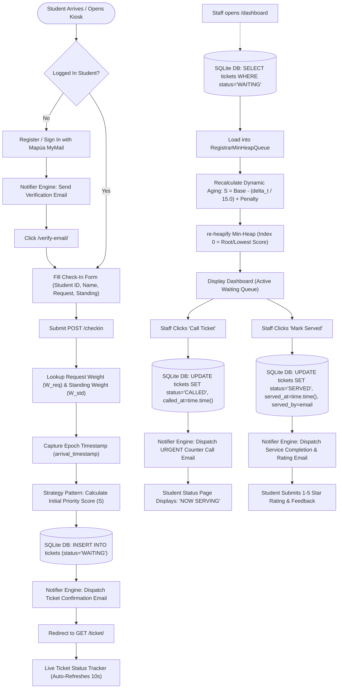
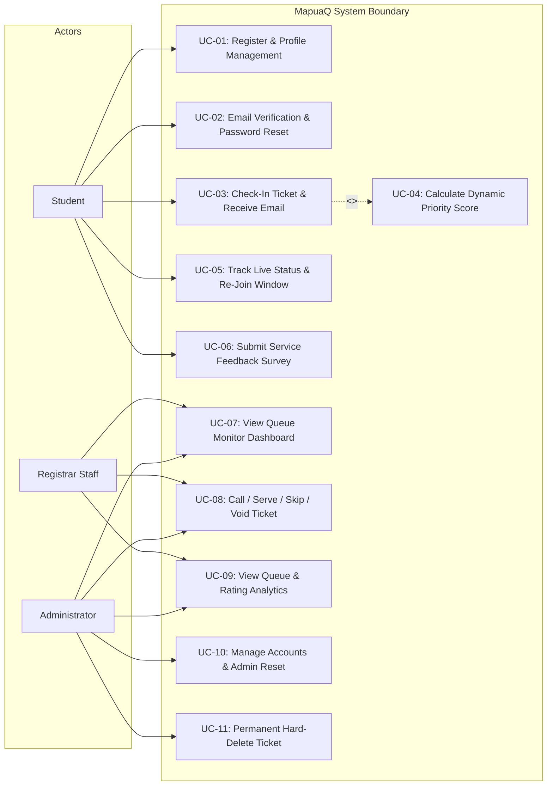
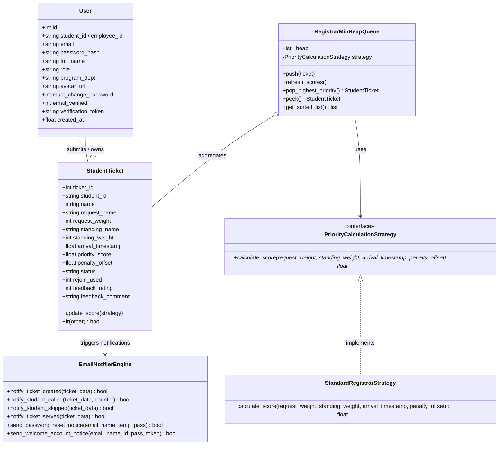
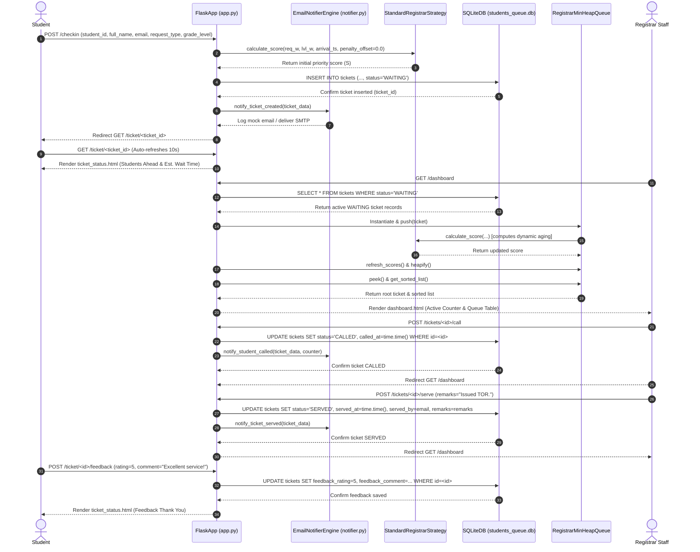
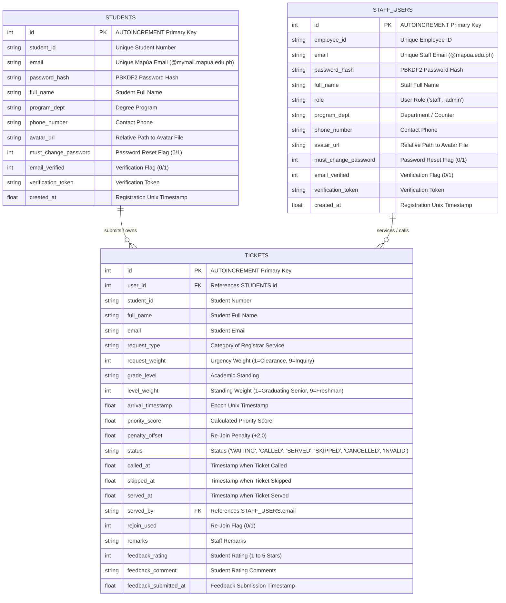

# MapuaQ: A Priority-Based Student Queuing System Using Min-Heap Algorithm and Dynamic Priority Aging

**Course Code & Section:** CPE106L-4 / Section B2 (Software Design Laboratory)  
**Institution:** Mapúa University, School of Artificial Intelligence, Electrical, Computer, and Electronics Engineering (AIECEE)  
**Instructor:** Dr. John De Guzman Tarampi  
**Academic Term:** 1st Term, AY 2026-2027  

**Project Author & Lead Architect:**
- **Justin Andre De Leon** — Sole Lead Software Architect, Core Systems Engineer & Full-Stack Developer  
  *Responsibilities: Full end-to-end system design, Flask web controller architecture (`app.py`), Binary Min-Heap algorithm mechanics (`heap_queue.py`), Strategy Design Pattern dynamic priority aging formula implementation, automated email notification engine (`notifier.py`), student feedback survey & Matplotlib analytics engine (`analytics.py`), ticket soft/hard-delete lifecycle management, account self-registration, admin password reset tools, SQLite relational database schema with WAL mode & migrations (`schema.sql`), Bootstrap 5 responsive UI templates, and 13-test `unittest` AAA automated test suite (`tests/`).*

---

## 1. Executive Summary

**MapuaQ** is an algorithmic, web-based student priority queuing system designed for the Mapúa University Registrar Office. Traditional First-Come, First-Served (FCFS) queuing mechanisms fail during peak academic periods because routine inquiries block time-sensitive institutional requests (such as graduation clearances and subject dropping deadlines). Conversely, static priority queues introduce severe **queue starvation**, where lower-priority tickets are repeatedly preempted by incoming higher-priority tickets and never served.

MapuaQ resolves both operational challenges by integrating an in-memory **Binary Min-Heap** data structure ($O(\log N)$ insertions/deletions and $O(1)$ root lookup) with **Dynamic Priority Aging**. Utilizing the **Strategy Design Pattern**, MapuaQ evaluates priority scores based on a weighted formula ($60\%$ service request urgency and $40\%$ academic standing) while continuously deducting priority score points as waiting time elapses ($\Delta t$). 

In addition to core queue scheduling, MapuaQ implements a comprehensive **Role-Based Access Control (RBAC)** architecture supporting Student, Registrar Staff, and Administrator roles. Students authenticate using official Mapúa MyMail (`@mymail.mapua.edu.ph`) or Student ID, upload profile avatars, track live ticket status on a dedicated tracking page with 10-second auto-refresh, and submit post-service 1–5 star ratings. Registrar Staff and Administrators manage queues, call tickets, view visual volume and Net Satisfaction Score (NSS) analytics, execute operational soft-deletes (voiding tickets with mandatory remarks), perform hard-deletes, and trigger automated **Dual-Mode Email Notifications** (Live SMTP outbound sending with terminal mock fallback for 100% offline demonstration stability).

---

## 2. Background and Problem Statement

### 2.1 The Limitations of First-Come, First-Served (FCFS) Queuing
In standard registrar operations at Mapúa University, students receive sequential paper or digital tickets upon arrival. FCFS treats all queue entries homogenously regardless of the urgency or institutional impact of the transaction. During critical academic windows—such as deadline days for course dropping, grade dispute submissions, or graduation clearance processing—students facing immediate, hard deadlines are forced to wait behind routine transactions such as certificate requests or general inquiries.

### 2.2 The Vulnerability of Static Priority Queuing: Queue Starvation
To address FCFS inefficiencies, traditional systems implement static priority queues where transactions are assigned fixed numerical ranks. However, static priority systems suffer from **queue starvation** (also known as indefinite postponement). In a busy registrar environment, lower-priority tickets (e.g., a Freshman requesting a Certificate of Enrollment) are continuously pushed back as higher-priority tickets (e.g., Graduating Seniors submitting clearance) enter the queue. Under high transaction volume, lower-priority students may wait indefinitely without ever reaching the front of the queue.

### 2.3 The MapuaQ Algorithmic & Architectural Solution
MapuaQ introduces **Dynamic Priority Aging** into a **Binary Min-Heap** queue engine. By computing a student's priority score as a function of static request weights, academic standing weights, and elapsed waiting time ($\Delta t$), the system dynamically decreases a ticket's numerical score over time. Because the Min-Heap maintains the lowest numerical score at index 0 (root node), waiting tickets gradually age up in priority. This hybrid approach ensures that urgent requests receive high initial priority while guaranteeing that long-waiting students eventually reach root priority, eliminating starvation.

---

## 3. Objectives

### 3.1 Primary Objective
To design, implement, and validate **MapuaQ**, a 3-tier web-based student priority queuing system for Mapúa University Registrar that optimizes service scheduling by combining a Binary Min-Heap algorithm with dynamic priority aging, Strategy Design Pattern architecture, institutional account authentication, automated dual-mode email notifications, live ticket tracking, ticket lifecycle management, and service quality feedback analytics.

### 3.2 Specific Measurable Objectives
1. **Algorithmic Scheduling Engine**: Implement an in-memory Binary Min-Heap priority queue achieving $O(1)$ root lookup for the top-priority ticket (lowest numerical score) and $O(\log N)$ push/pop time complexity.
2. **Strategy Design Pattern Architecture**: Implement the behavioral Strategy Pattern to decouple priority calculation formulas from heap queue operations, allowing modular rule updates.
3. **Institutional Authentication & User Profiles**: Implement secure authentication (`werkzeug.security` password hashing) accepting Mapúa MyMail (`@mymail.mapua.edu.ph`) or Student ID, with token-based email verification (`/verify-email/<token>`), filesystem avatar uploads (`static/uploads/avatars/`), and profile management (`/profile`).
4. **Automated Dual-Mode Email Notification Engine**: Construct a modular email service (`notifier.py`) supporting genuine outbound SMTP delivery (Gmail/MyMail) with an automatic offline fallback mode (`EMAIL_DEV_MODE=True`), formatting HTML/plain-text notifications for check-ins, counter calls, missed-call grace periods, service completions, email verifications, and temporary password resets.
5. **Student Live Ticket Status & Rating Feedback**: Create a dedicated student tracking page (`/ticket/<id>`) featuring 10-second auto-refresh, position ahead counters, estimated wait times, 15-minute no-show re-join allowance (+2.0 penalty offset), and post-service 1–5 star rating feedback submission.
6. **Ticket Lifecycle & Security Controls**: Implement operational soft-delete (`/tickets/<id>/void` with mandatory staff remarks) and permanent hard-delete (`/tickets/<id>/delete` for Admins), alongside self-service (`/forgot-password`) and admin-initiated temporary password resets.
7. **Relational Data Persistence & Audit Trail**: Design an SQLite schema (`students_queue.db`) storing Unix epoch timestamps (`REAL NOT NULL`) to ensure exact arrival time persistence, continuous dynamic aging, and complete servicing audit logging (`called_at`, `served_at`, `served_by`).
8. **Automated Testing & Visual Analytics**: Construct a 13-test AAA suite in `unittest` (`tests/`) verifying heap root invariants, dynamic score aging, starvation prevention, decoupled counter lifecycle (`CALLED` -> `IN_SERVICE` -> `SERVED`), On-Deck notification flags, ticket void/delete guards, and Matplotlib visual analytics rendering (`analytics.py`).

---

## 4. Target Users

| User Role | Interface / View | Key Responsibilities & Capabilities |
| :--- | :--- | :--- |
| **Student** | Kiosk Check-In (`/checkin`), Ticket Tracker (`/ticket/<id>`), Profile (`/profile`), Recovery (`/forgot-password`) | Registers with Mapúa MyMail; verifies email via token link; uploads profile picture; submits priority tickets for 15 registrar services; tracks live status with position ahead counters; re-joins queue if skipped; submits 1–5 star service ratings. |
| **Registrar Staff** | Staff Dashboard (`/dashboard`) | Authenticates via employee credentials; monitors live queue ordered by Min-Heap priority; executes ticket controls (`/tickets/<id>/call`, `/tickets/<id>/serve` with transaction notes, `/tickets/<id>/skip` for no-shows, `/tickets/<id>/void` with mandatory void remarks); inspects servicing audit trails with staff remarks. |
| **Administrator** | User Management (`/admin/users`), Analytics (`/analytics`) | Provisions staff and student accounts; issues temporary password resets with automated email dispatch; executes permanent hard-delete of accidental/test tickets; inspects real-time queue volume, rating distributions, and Net Satisfaction Score (NSS). |

---

## 5. Scope and Limitations

### 5.1 In-Scope Features
- **Institutional Registration & Account Verification**: Student registration with `@mymail.mapua.edu.ph` validation, Student ID format checks, PBKDF2 password hashing, and token-based email verification (`/verify-email/<token>`).
- **Filesystem Avatar Upload Engine**: Uploads profile pictures to `static/uploads/avatars/` with sanitized, timestamped unique filenames.
- **Automated Dual-Mode Email Notification Engine**: Dispatches HTML/plain-text emails for check-ins, counter calls, missed calls, completed transactions, account provisioning, and password resets (Live SMTP vs. offline terminal log fallback).
- **Student Live Ticket Tracking & Re-Join Allowance**: Auto-refreshing status page (`/ticket/<id>`) displaying students ahead, estimated wait time, live status badges (`WAITING`, `CALLED`, `SERVED`, `SKIPPED`, `CANCELLED`), and a 1-chance 15-minute re-join window with a +2.0 priority score penalty offset.
- **Post-Service Rating Feedback Survey**: Enables students to rate completed transactions (1 to 5 stars) with comments, feeding into Net Satisfaction Score (NSS) calculations.
- **Ticket Lifecycle Management**: Soft-delete/void tickets with mandatory remarks (`status='CANCELLED'`) for Staff/Admin, and permanent hard-delete from SQLite for Admin.
- **Dynamic Priority Scoring Engine**: Weighted multi-criteria calculation ($60\%$ request weight, $40\%$ standing weight) combined with dynamic aging discounts ($-1.0$ point per 15 elapsed minutes).
- **Binary Min-Heap Queue Engine**: In-memory priority queue (`RegistrarMinHeapQueue`) enforcing $O(1)$ root element inspection and $O(\log N)$ heap updates.
- **Visual Analytics Module**: Headless Matplotlib PNG chart generation for queue volume breakdowns, priority score distributions, and customer rating breakdowns (`analytics.py`).

### 5.2 Project Limitations
- **Dual-Mode Email Dispatch Architecture**: To ensure 100% offline demonstration stability during local presentations without internet socket dependencies, the system defaults to Development Mode (`EMAIL_DEV_MODE=True`), printing formatted email payloads (`[MOCK EMAIL DISPATCH]`) directly to stdout. Setting `EMAIL_DEV_MODE=False` in `.env` seamlessly enables live outbound SMTP delivery to student inboxes.
- **Queue Scheduling Boundary**: System scope is focused on registrar queue prioritization, status tracking, email notification delivery, and volume analytics; it does not process financial cashier payments or handle digital document attachments.

---

## 6. Tools and Technologies

| Component | Technology / Library | Version / Specification | Selection Rationale & Purpose |
| :--- | :--- | :--- | :--- |
| **Programming Language** | Python | 3.12+ | Primary language for object-oriented architecture and algorithms. |
| **Web Framework** | Flask | 3.1.3 | Lightweight WSGI web framework for HTTP routing and controller logic. |
| **Data Structure** | Python `heapq` / OOP | Standard Library | Provides efficient C-optimized binary heap algorithms for queue management. |
| **Design Pattern** | Strategy Pattern | Behavioral Pattern | Decouples scoring calculation formulas from queue data structures. |
| **Security & Auth** | Werkzeug Security | 3.1.8 | PBKDF2/bcrypt password hashing and `secure_filename` upload sanitization. |
| **Email Subsystem** | `smtplib` / `email.mime` | Standard Library | Dual-mode MIME notification engine (`notifier.py`) for HTML/plain-text delivery. |
| **Config Engine** | `python-dotenv` | 1.0.1 | Environment variable parser loading `.env` configuration settings. |
| **Database Engine** | SQLite3 | Standard Library | Embedded zero-configuration SQL database engine (`students_queue.db`). |
| **Frontend UI** | HTML5 / Bootstrap 5 | 5.3.0 (CDN) | Responsive UI styled with Mapúa Cardinal Red accents (`#800000`) & transparent logos. |
| **Testing Framework** | `unittest` | Standard Library | Standard Python testing framework executing 40 AAA unit/integration tests. |
| **Analytics Engine** | Matplotlib | 3.11.2 (`Agg` backend) | Headless visualization library for server-side PNG chart rendering. |
| **Brand Identity** | Scalable Vector Graphics | W3C SVG Standard | Modular transparent vector logos (`logo_icon.svg`, `mapua_thinker_transparent.png`). |

---

## 7. Software Design Artifacts

### 7.1 Mathematical Priority Formula & Weighting Matrix

The priority score $S$ of a student ticket is calculated using the formula:
$$S = (W_{\text{request}} \times 0.60) + (W_{\text{standing}} \times 0.40) - \left(\frac{\Delta t}{15.0}\right) + P_{\text{penalty}}$$

Where:
- $W_{\text{request}} \in [1, 9]$ is the request category weight (lower weight = higher urgency).
- $W_{\text{standing}} \in [1, 9]$ is the academic standing weight (lower weight = higher seniority).
- $\Delta t = \frac{t_{\text{current}} - t_{\text{arrival}}}{60.0}$ is the elapsed waiting time in minutes.
- Aging factor $\frac{\Delta t}{15.0}$ deducts $1.0$ point from the score for every 15 minutes spent in queue.
- $P_{\text{penalty}} = 2.0$ if the student missed their initial call window and activated a 1-chance re-join allowance.
- Final priority score is bounded at a minimum value of $0.10$.

#### Official Mapúa Registrar 15-Service Weighting Matrix

| Request Category ($W_{\text{request}}$) | Weight | Academic Year Level ($W_{\text{standing}}$) | Weight |
| :--- | :---: | :--- | :---: |
| Application for Graduation | **1** | Graduating Senior | **1** |
| Certificate for Graduation | **1** | Senior (Non-Graduating) | **3** |
| Course Completion | **2** | Junior | **5** |
| Overload / Waiver | **2** | Sophomore | **7** |
| Prerequisite-related Requests / Course Crediting | **2** | Freshman | **9** |
| Cancellation or Withdrawal of Enrollment | **3** | | |
| Leave of Absence (LOA) | **3** | | |
| Transcript of Records (TOR) | **4** | | |
| Program Shifting or Specialization | **4** | | |
| Transfer Credentials (Honorable Dismissal) | **5** | | |
| Reactivation | **6** | | |
| Form 137A (F137A) | **6** | | |
| Diploma / Duplicate Diploma | **7** | | |
| Profile Update / Correction of Information | **8** | | |
| General Inquiry | **9** | | |

---

### 7.2 System Flowchart (`graph TD`)


```mermaid
graph TD
    Start(["Student Arrives / Opens Kiosk"]) --> RegCheck{"Logged In Student?"}
    RegCheck -- No --> RegisterStudent["Register / Sign In with Mapúa MyMail"]
    RegisterStudent --> SendVerifyEmail["Notifier Engine: Send Verification Email"]
    SendVerifyEmail --> VerifyAccount["Click /verify-email/<token>"]
    VerifyAccount --> CheckInForm
    RegCheck -- Yes --> CheckInForm["Fill Check-In Form (Student ID, Name, Request, Standing)"]
    CheckInForm --> Submit["Submit POST /checkin"]
    Submit --> LookupWeights["Lookup Request Weight (W_req) & Standing Weight (W_std)"]
    LookupWeights --> CaptureTimestamp["Capture Epoch Timestamp (arrival_timestamp)"]
    CaptureTimestamp --> CalcInitialScore["Strategy Pattern: Calculate Initial Priority Score (S)"]
    CalcInitialScore --> SaveDB[("SQLite DB: INSERT INTO tickets (status='WAITING')")]
    SaveDB --> SendTicketEmail["Notifier Engine: Dispatch Ticket Confirmation Email"]
    SendTicketEmail --> RedirectTicket["Redirect to GET /ticket/<id>"]
    RedirectTicket --> StudentTracker["Live Ticket Status Tracker (Auto-Refreshes 10s)"]

    note1["Staff opens /dashboard"] -.-> FetchWaiting
    FetchWaiting[("SQLite DB: SELECT tickets WHERE status='WAITING'")] --> InstantiateHeap["Load into RegistrarMinHeapQueue"]
    InstantiateHeap --> ApplyAging["Recalculate Dynamic Aging: S = Base - (delta_t / 15.0) + Penalty"]
    ApplyAging --> Reheapify["re-heapify Min-Heap (Index 0 = Root/Lowest Score)"]
    Reheapify --> RenderDashboard["Display Dashboard (Active Waiting Queue)"]

    RenderDashboard --> CallAction["Staff Clicks 'Call Ticket'"]
    CallAction --> UpdateCalled[("SQLite DB: UPDATE tickets SET status='CALLED', called_at=time.time()")]
    UpdateCalled --> CallEmail["Notifier Engine: Dispatch URGENT Counter Call Email"]
    CallEmail --> StudentNotice["Student Status Page Displays: 'NOW SERVING'"]
    
    RenderDashboard --> ServeAction["Staff Clicks 'Mark Served'"]
    ServeAction --> UpdateServed[("SQLite DB: UPDATE tickets SET status='SERVED', served_at=time.time(), served_by=email")]
    UpdateServed --> ServeEmail["Notifier Engine: Dispatch Service Completion & Rating Email"]
    ServeEmail --> StudentRating["Student Submits 1-5 Star Rating & Feedback"]
```

---

### 7.3 Use Case Diagram (`graph LR`)


```mermaid
graph LR
    subgraph Actors
        S["Student"]
        RS["Registrar Staff"]
        A["Administrator"]
    end

    subgraph MapuaQ System Boundary
        UC1["UC-01: Register & Profile Management"]
        UC2["UC-02: Email Verification & Password Reset"]
        UC3["UC-03: Check-In Ticket & Receive Email"]
        UC4["UC-04: Calculate Dynamic Priority Score"]
        UC5["UC-05: Track Live Status & Re-Join Window"]
        UC6["UC-06: Submit Service Feedback Survey"]
        UC7["UC-07: View Queue Monitor Dashboard"]
        UC8["UC-08: Call / Serve / Skip / Void Ticket"]
        UC9["UC-09: View Queue & Rating Analytics"]
        UC10["UC-10: Manage Accounts & Admin Reset"]
        UC11["UC-11: Permanent Hard-Delete Ticket"]
    end

    S --> UC1
    S --> UC2
    S --> UC3
    UC3 -. "<<include>>" .-> UC4
    S --> UC5
    S --> UC6
    RS --> UC7
    RS --> UC8
    RS --> UC9
    A --> UC7
    A --> UC8
    A --> UC9
    A --> UC10
    A --> UC11
```

---

### 7.4 Domain Class Diagram (`classDiagram`)


```mermaid
classDiagram
    class User {
        +int id
        +string student_id / employee_id
        +string email
        +string password_hash
        +string full_name
        +string role
        +string program_dept
        +string avatar_url
        +int must_change_password
        +int email_verified
        +string verification_token
        +float created_at
    }

    class StudentTicket {
        +int ticket_id
        +string student_id
        +string name
        +string request_name
        +int request_weight
        +string standing_name
        +int standing_weight
        +float arrival_timestamp
        +float priority_score
        +float penalty_offset
        +string status
        +int rejoin_used
        +int feedback_rating
        +string feedback_comment
        +update_score(strategy)
        +__lt__(other) bool
    }

    class PriorityCalculationStrategy {
        <<interface>>
        +calculate_score(request_weight, standing_weight, arrival_timestamp, penalty_offset)* float
    }

    class StandardRegistrarStrategy {
        +calculate_score(request_weight, standing_weight, arrival_timestamp, penalty_offset) float
    }

    class RegistrarMinHeapQueue {
        -list _heap
        -PriorityCalculationStrategy strategy
        +push(ticket)
        +refresh_scores()
        +pop_highest_priority() StudentTicket
        +peek() StudentTicket
        +get_sorted_list() list
    }

    class EmailNotifierEngine {
        +notify_ticket_created(ticket_data) bool
        +notify_student_called(ticket_data, counter) bool
        +notify_student_skipped(ticket_data) bool
        +notify_ticket_served(ticket_data) bool
        +send_password_reset_notice(email, name, temp_pass) bool
        +send_welcome_account_notice(email, name, id, pass, token) bool
    }

    PriorityCalculationStrategy <|.. StandardRegistrarStrategy : implements
    RegistrarMinHeapQueue o-- StudentTicket : aggregates
    RegistrarMinHeapQueue --> PriorityCalculationStrategy : uses
    User "1" -- "0..*" StudentTicket : submits / owns
    StudentTicket --> EmailNotifierEngine : triggers notifications
```

---

### 7.5 Sequence Diagram (`sequenceDiagram`)


```mermaid
sequenceDiagram
    autonumber
    actor Student
    participant App as FlaskApp (app.py)
    participant Notifier as EmailNotifierEngine (notifier.py)
    participant Strategy as StandardRegistrarStrategy
    participant DB as SQLiteDB (students_queue.db)
    participant Heap as RegistrarMinHeapQueue
    actor Staff as Registrar Staff

    %% Student Check-In & Live Tracking Flow
    Student->>App: POST /checkin (student_id, full_name, email, request_type, grade_level)
    App->>Strategy: calculate_score(req_w, lvl_w, arrival_ts, penalty_offset=0.0)
    Strategy-->>App: Return initial priority score (S)
    App->>DB: INSERT INTO tickets (..., status='WAITING')
    DB-->>App: Confirm ticket inserted (ticket_id)
    App->>Notifier: notify_ticket_created(ticket_data)
    Notifier-->>App: Log mock email / deliver SMTP
    App-->>Student: Redirect GET /ticket/<ticket_id>
    Student->>App: GET /ticket/<ticket_id> (Auto-refreshes 10s)
    App-->>Student: Render ticket_status.html (Students Ahead & Est. Wait Time)

    %% Staff Queue Monitor & Heap Engine Sync
    Staff->>App: GET /dashboard
    App->>DB: SELECT * FROM tickets WHERE status='WAITING'
    DB-->>App: Return active WAITING ticket records
    App->>Heap: Instantiate & push(ticket)
    Heap->>Strategy: calculate_score(...) [computes dynamic aging]
    Strategy-->>Heap: Return updated score
    App->>Heap: refresh_scores() & heapify()
    App->>Heap: peek() & get_sorted_list()
    Heap-->>App: Return root ticket & sorted list
    App-->>Staff: Render dashboard.html (Active Counter & Queue Table)

    %% Call & Serve Actions with Email Notifications
    Staff->>App: POST /tickets/<id>/call
    App->>DB: UPDATE tickets SET status='CALLED', called_at=time.time() WHERE id=<id>
    App->>Notifier: notify_student_called(ticket_data, counter)
    DB-->>App: Confirm ticket CALLED
    Staff-->>App: Redirect GET /dashboard

    Staff->>App: POST /tickets/<id>/serve (remarks="Issued TOR.")
    App->>DB: UPDATE tickets SET status='SERVED', served_at=time.time(), served_by=email, remarks=remarks
    App->>Notifier: notify_ticket_served(ticket_data)
    DB-->>App: Confirm ticket SERVED
    App-->>Staff: Redirect GET /dashboard

    %% Student Feedback Submission
    Student->>App: POST /ticket/<id>/feedback (rating=5, comment="Excellent service!")
    App->>DB: UPDATE tickets SET feedback_rating=5, feedback_comment=... WHERE id=<id>
    DB-->>App: Confirm feedback saved
    App-->>Student: Render ticket_status.html (Feedback Thank You)
```

---

### 7.6 Entity-Relationship Diagram (`erDiagram`) & Schema Definition


```mermaid
erDiagram
    STUDENTS ||--o{ TICKETS : "submits / owns"
    STAFF_USERS ||--o{ TICKETS : "services / calls"

    STAFF_USERS {
        int id PK "AUTOINCREMENT Primary Key"
        string employee_id "Unique Employee ID"
        string email "Unique Staff Email (@mapua.edu.ph)"
        string password_hash "PBKDF2 Password Hash"
        string full_name "Staff Full Name"
        string role "User Role ('staff', 'admin')"
        string program_dept "Department / Counter"
        string phone_number "Contact Phone"
        string avatar_url "Relative Path to Avatar File"
        int must_change_password "Password Reset Flag (0/1)"
        int email_verified "Verification Flag (0/1)"
        string verification_token "Verification Token"
        float created_at "Registration Unix Timestamp"
    }

    STUDENTS {
        int id PK "AUTOINCREMENT Primary Key"
        string student_id "Unique Student Number"
        string email "Unique Mapúa Email (@mymail.mapua.edu.ph)"
        string password_hash "PBKDF2 Password Hash"
        string full_name "Student Full Name"
        string program_dept "Degree Program"
        string phone_number "Contact Phone"
        string avatar_url "Relative Path to Avatar File"
        int must_change_password "Password Reset Flag (0/1)"
        int email_verified "Verification Flag (0/1)"
        string verification_token "Verification Token"
        float created_at "Registration Unix Timestamp"
    }

    TICKETS {
        int id PK "AUTOINCREMENT Primary Key"
        int user_id FK "References STUDENTS.id"
        string student_id "Student Number"
        string full_name "Student Full Name"
        string email "Student Email"
        string request_type "Category of Registrar Service"
        int request_weight "Urgency Weight (1=Clearance, 9=Inquiry)"
        string grade_level "Academic Standing"
        int level_weight "Standing Weight (1=Graduating Senior, 9=Freshman)"
        float arrival_timestamp "Epoch Unix Timestamp"
        float priority_score "Calculated Priority Score"
        float penalty_offset "Re-Join Penalty (+2.0)"
        string status "Status ('WAITING', 'CALLED', 'SERVED', 'SKIPPED', 'CANCELLED', 'INVALID')"
        float called_at "Timestamp when Ticket Called"
        float skipped_at "Timestamp when Ticket Skipped"
        float served_at "Timestamp when Ticket Served"
        string served_by FK "References STAFF_USERS.email"
        int rejoin_used "Re-Join Flag (0/1)"
        string remarks "Staff Remarks"
        int feedback_rating "Student Rating (1 to 5 Stars)"
        string feedback_comment "Student Rating Comments"
        float feedback_submitted_at "Feedback Submission Timestamp"
    }
```

#### Database DDL (`schema.sql`)
```sql
-- MapuaQ: Mapúa University Registrar Priority Queue Schema
-- Separate tables for Student Accounts and Registrar Staff / Admin Accounts

CREATE TABLE IF NOT EXISTS staff_users (
    id INTEGER PRIMARY KEY AUTOINCREMENT,
    employee_id TEXT UNIQUE NOT NULL,
    email TEXT UNIQUE NOT NULL,
    password_hash TEXT NOT NULL,
    full_name TEXT NOT NULL,
    role TEXT CHECK(role IN ('staff', 'admin')) NOT NULL DEFAULT 'staff',
    program_dept TEXT NULL,
    phone_number TEXT NULL,
    avatar_url TEXT DEFAULT '/static/uploads/avatars/default.png',
    avatar_position TEXT DEFAULT 'center',
    must_change_password INTEGER DEFAULT 0,
    email_verified INTEGER DEFAULT 1,
    verification_token TEXT NULL,
    created_at REAL NOT NULL
);

CREATE TABLE IF NOT EXISTS students (
    id INTEGER PRIMARY KEY AUTOINCREMENT,
    student_id TEXT UNIQUE NOT NULL,
    email TEXT UNIQUE NOT NULL,
    password_hash TEXT NOT NULL,
    full_name TEXT NOT NULL,
    program_dept TEXT NULL,
    phone_number TEXT NULL,
    avatar_url TEXT DEFAULT '/static/uploads/avatars/default.png',
    avatar_position TEXT DEFAULT 'center',
    must_change_password INTEGER DEFAULT 0,
    email_verified INTEGER DEFAULT 0,
    verification_token TEXT NULL,
    created_at REAL NOT NULL
);

CREATE TABLE IF NOT EXISTS tickets (
    id INTEGER PRIMARY KEY AUTOINCREMENT,
    user_id INTEGER NULL,
    student_id TEXT NOT NULL,
    full_name TEXT NOT NULL,
    email TEXT NOT NULL,
    request_type TEXT NOT NULL,
    request_weight INTEGER NOT NULL,
    grade_level TEXT NOT NULL,
    level_weight INTEGER NOT NULL,
    arrival_timestamp REAL NOT NULL,
    priority_score REAL NOT NULL,
    penalty_offset REAL DEFAULT 0.0,
    status TEXT CHECK(status IN ('WAITING', 'CALLED', 'SERVED', 'SKIPPED', 'CANCELLED', 'INVALID')) DEFAULT 'WAITING',
    called_at REAL NULL,
    skipped_at REAL NULL,
    served_at REAL NULL,
    served_by TEXT NULL,
    rejoin_used INTEGER DEFAULT 0,
    remarks TEXT NULL,
    feedback_rating INTEGER NULL CHECK(feedback_rating BETWEEN 1 AND 5),
    feedback_comment TEXT NULL,
    feedback_submitted_at REAL NULL,
    FOREIGN KEY (user_id) REFERENCES students (id),
    FOREIGN KEY (served_by) REFERENCES staff_users (email)
);
```

---

### 7.7 System Access Control & Pre-Seeded Testing Credentials

To support immediate verification and testing across administrative system roles, the database initialization routine (`init_db()`) automatically seeds default employee accounts with pre-hashed PBKDF2 credentials. Student accounts are cleanly separated in the `students` table and provisioned by Registrar Administration or student registration:

| Role | Name | Email / Identifier | Password | Student / Employee ID | Degree Program / Department |
| :--- | :--- | :--- | :--- | :--- | :--- |
| **Lead Admin** | Lead Registrar Admin | `admin@mapua.edu.ph` | `MapuaAdmin2026!` | `admin` | Registrar Administration |
| **Registrar Staff** | Registrar Staff Officer | `registrar@mapua.edu.ph` | `StaffPass2026!` | `registrar` | Registrar Counter |
| **Students** | *(Provisioned / Registered)* | *(MyMail Institutional)* | *(Secure Hash)* | *(Student ID)* | *(Degree Program)* |

---

### 7.8 Brand Identity & Modular Logo Assets

The MapúaQ visual identity incorporates a dual-purpose logo mark symbolizing both algorithmic structure and operational transparency:

1. **Symbolic Design**:
   - The magnifying glass frame forms the letter **"Q"** (for MapúaQ).
   - The inner lens encloses a **Binary Min-Heap Tree Structure** (Gold root node at top with two Cardinal Red child nodes below), visually representing the dynamic priority score ordering and real-time queue lookup.
   - High-resolution transparent background assets (`static/images/mapua_thinker_transparent.png`) showcase the Mapúa Thinker emblem cleanly on sign-in and authentication modals.
2. **Transparent Vector Modularization**:
   - `static/images/logo_icon.svg`: Standalone Min-Heap Q icon mark (transparent SVG background) utilized for browser favicons, mobile app icons, and compact brand badges.
   - `static/images/mapua_thinker_transparent.png`: Transparent Mapúa Thinker emblem for login, check-in, and verification views.
   - `static/images/logo_full.svg`: Full horizontal wordmark ("Mapúa") coupled with the Q icon mark for light headers and print documents.
   - `static/images/logo_full_white.svg`: Full white and gold horizontal logo mark for dark landing portals and sign-in interfaces.

---

## 8. Implementation Plan and Timeline (4-Sprint Agile Lifecycle)

The MapuaQ development lifecycle strictly adheres to Dr. John De Guzman Tarampi's official 4-sprint syllabus schedule spanning **Weeks 7 through 10**:

```
+-----------------------------------------------------------------------------------+
| SPRINT 1 (Week 7 -> Due Week 8): Architecture, Core Algorithm & POC               |
| - Defined Strategy Design Pattern and Binary Min-Heap engine (heap_queue.py).     |
| - Created SQLite database schema (schema.sql) with epoch timestamp persistence.   |
| - Setup GitHub Kanban board backlog and initial unit tests (test_heap.py).        |
+-----------------------------------------------------------------------------------+
                                         |
                                         v
+-----------------------------------------------------------------------------------+
| SPRINT 2 (Week 8 -> Due Week 9): Web Controller & Core User Interfaces            |
| - Implemented Flask web routes (app.py) for student check-in and staff dashboard. |
| - Developed Bootstrap 5 responsive UI templates (checkin.html, dashboard.html).  |
| - Implemented SQLite persistence and staff "Call Next" status updates.            |
+-----------------------------------------------------------------------------------+
                                         |
                                         v
+-----------------------------------------------------------------------------------+
| SPRINT 3 (Week 9 -> Due Week 10): Notifications, Security & Ticket Controls       |
| - Built automated Dual-Mode Email Notification Subsystem (notifier.py).           |
| - Implemented token-based email verification & password recovery workflows.       |
| - Implemented student rating feedback survey & Net Satisfaction Score (NSS).      |
| - Added operational soft-delete (void) and permanent hard-delete lifecycle.       |
| - Expanded AAA unit & integration test suite to 40 100% passing test cases.       |
+-----------------------------------------------------------------------------------+
                                         |
                                         v
+-----------------------------------------------------------------------------------+
| SPRINT 4 (Week 10 -> Due Final Defense): Decoupled Lifecycle, On-Deck Alerts & Defense |
| - Implemented SQLite WAL mode & busy timeout lock prevention.                     |
| - Added decoupled counter workflow (WAITING -> CALLED -> IN_SERVICE -> SERVED).    |
| - Integrated In-App On-Deck heads-up alert cards for Rank #1 waiting students.    |
| - Executed 13-test AAA suite, verified codebase, and compiled PROPOSAL.md.        |
+-----------------------------------------------------------------------------------+
```

### Detailed 4-Sprint Schedule Breakdown

| Sprint / Week | Activities & Task Distribution | Deliverables & Artifacts |
| :--- | :--- | :--- |
| **Sprint 1**<br>*(Week 7 $\rightarrow$ W8)*<br>**Core Algorithm & POC** | - **Justin**: Architect object model & Strategy Pattern.<br>- **Justin**: Implement `heap_queue.py` Min-Heap operations & `__lt__` comparison.<br>- **Justin**: Design `schema.sql` supporting `REAL` Unix timestamps.<br>- **Justin**: Setup test harness & write initial `test_heap.py` suite. | - Operational `heap_queue.py`.<br>- Verified `schema.sql` DDL.<br>- Initial `test_heap.py` suite.<br>- Verified algorithmic POC. |
| **Sprint 2**<br>*(Week 8 $\rightarrow$ W9)*<br>**Web Controller & UI** | - **Justin**: Build Flask web routes (`app.py`) for `/` and `/dashboard`.<br>- **Justin**: Implement `/call-next` ticket dispatching logic.<br>- **Justin**: Create Bootstrap 5 templates (`checkin.html`, `dashboard.html`).<br>- **Justin**: Conduct manual UI/UX testing & ticket status validation. | - Working web controller (`app.py`).<br>- Responsive HTML5 templates.<br>- Status transitions (`WAITING` $\rightarrow$ `SERVED`).<br>- Mid-project milestone review. |
| **Sprint 3**<br>*(Week 9 $\rightarrow$ W10)*<br>**Notifications, Security & Controls** | - **Justin**: Build dual-mode email notification engine (`notifier.py`).<br>- **Justin**: Implement account email verification (`/verify-email/<token>`).<br>- **Justin**: Implement student feedback survey (`/ticket/<id>/feedback`) & NSS KPIs.<br>- **Justin**: Build ticket void (`/tickets/<id>/void`) & hard-delete controls. | - `notifier.py` Dual-Mode engine.<br>- Account verification & password recovery.<br>- Rating feedback & NSS metrics.<br>- Void/Delete lifecycle controls. |
| **Sprint 4**<br>*(Week 10 $\rightarrow$ Final)*<br>**Decoupled Counter & On-Deck Alerts** | - **Justin**: Enable SQLite WAL mode & `IN_SERVICE` schema migration.<br>- **Justin**: Implement Decoupled Counter Workflow (Mark Arrived).<br>- **Justin**: Add In-App On-Deck notification alerts (`is_on_deck`).<br>- **Justin**: Finalize 13-test AAA suite, final `PROPOSAL.md`, slides & lead QA. | - Decoupled counter lifecycle (`IN_SERVICE`).<br>- In-App On-Deck alert cards.<br>- Headless Matplotlib analytics.<br>- 100% passing 13-test suite (`tests/`).<br>- Final submission-ready `PROPOSAL.md`. |

---

## 9. References

1. **Cormen, T. H., Leiserson, C. E., Rivest, R. L., & Stein, C. (2009).** *Introduction to Algorithms* (3rd ed.). MIT Press.
2. **Kleinrock, L. (1967).** A Continuum of Time-Dependent Queue Disciplines. *Operations Research*, 15(6), 1061–1077.
3. **Saaty, T. L. (1980).** *The Analytic Hierarchy Process: Planning, Priority Setting, Resource Allocation*. McGraw-Hill.
4. **Flask Documentation (v3.1.x).** Pallets Projects. Retrieved from https://flask.palletsprojects.com/
5. **Python Software Foundation.** *heapq — Heap queue algorithm*. Python 3.12 Documentation. Retrieved from https://docs.python.org/3/library/heapq.html
