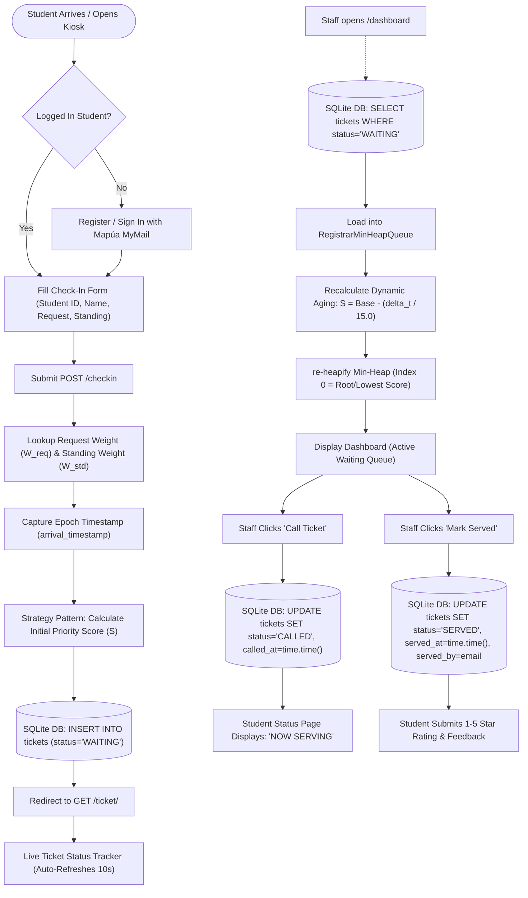
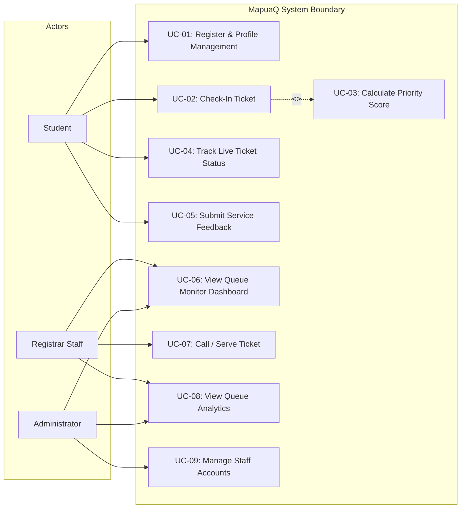
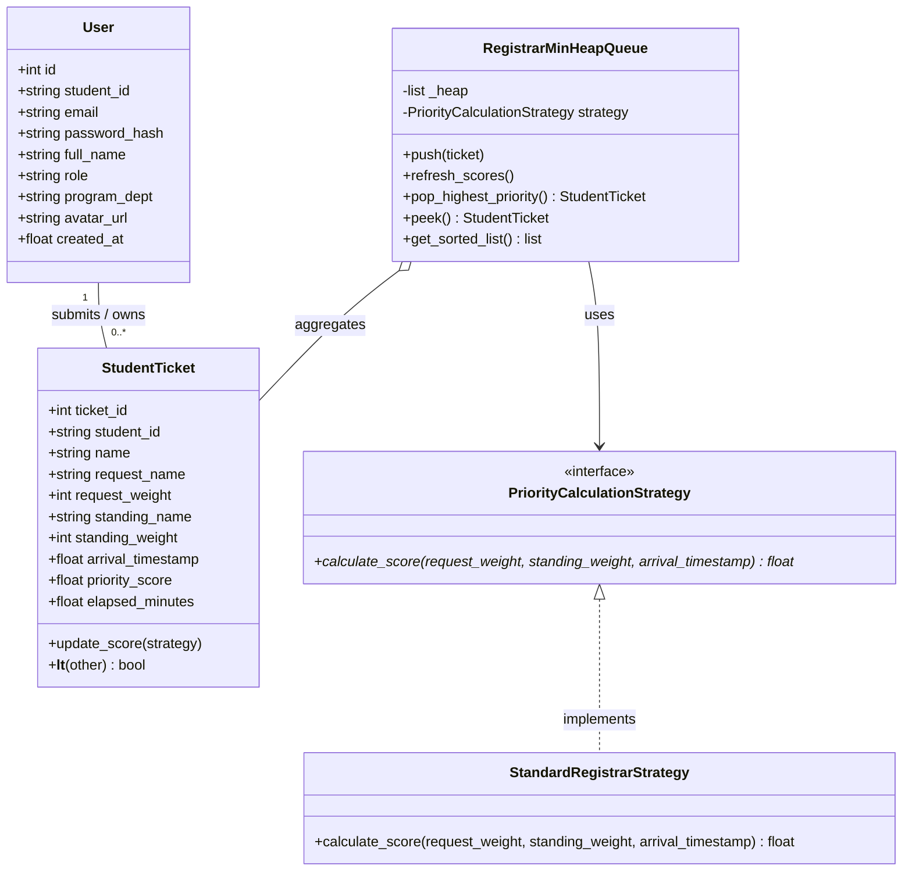
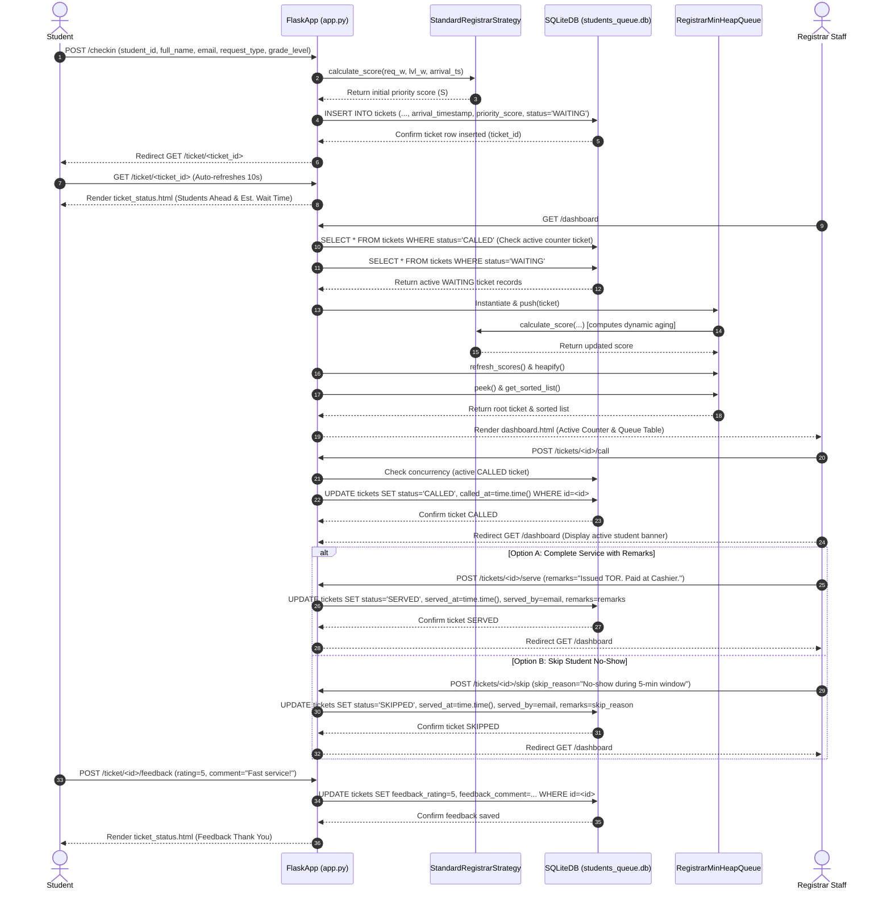
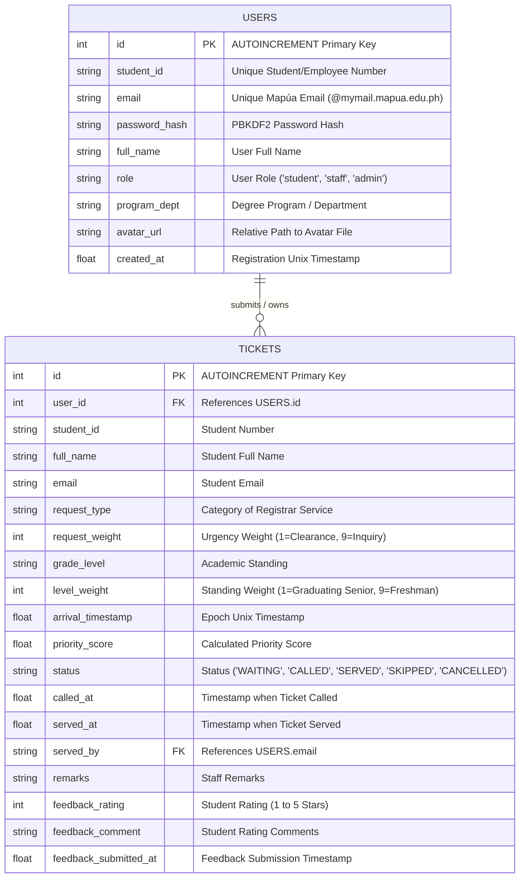

# MapuaQ: A Priority-Based Student Queuing System Using Min-Heap Algorithm and Dynamic Priority Aging

**Course Code & Section:** CPE106L-4 / Section B2 (Software Design Laboratory)  
**Institution:** Mapúa University, School of Artificial Intelligence, Electrical, Computer, and Electronics Engineering (AIECEE)  
**Instructor:** Dr. John De Guzman Tarampi  
**Academic Term:** 1st Term, AY 2026-2027  

**Project Author & Lead Architect:**
- **Justin Andre De Leon** — Sole Lead Software Architect, Core Systems Engineer & Full-Stack Developer  
  *Responsibilities: Full end-to-end system design, Flask web controller architecture, Binary Min-Heap algorithm mechanics (`heap_queue.py`), Strategy Design Pattern dynamic priority aging formula implementation, SQLite relational database schema & migrations (`schema.sql`), Bootstrap 5 responsive UI templates, Matplotlib analytics engine (`analytics.py`), institutional MyMail authentication with profile avatar uploads, live ticket tracking system (`/ticket/<id>`), and `unittest` AAA automated test suite (`tests/`).*

---

## 1. Executive Summary

**MapuaQ** is an algorithmic, web-based student priority queuing system designed for the Mapúa University Registrar Office. Traditional First-Come, First-Served (FCFS) queuing mechanisms fail during peak academic periods because routine inquiries block time-sensitive institutional requests (such as graduation clearances and subject dropping deadlines). Conversely, static priority queues introduce severe **queue starvation**, where lower-priority tickets are repeatedly preempted by incoming higher-priority tickets and never served.

MapuaQ resolves both operational challenges by integrating an in-memory **Binary Min-Heap** data structure ($O(\log N)$ insertions/deletions and $O(1)$ root lookup) with **Dynamic Priority Aging**. Utilizing the **Strategy Design Pattern**, MapuaQ evaluates priority scores based on a weighted formula ($60\%$ service request urgency and $40\%$ academic standing) while continuously deducting priority score points as waiting time elapses ($\Delta t$). 

In addition to core queue scheduling, MapuaQ implements a comprehensive **Role-Based Access Control (RBAC)** architecture supporting Student, Registrar Staff, and Administrator roles. Students authenticate using official Mapúa MyMail (`@mymail.mapua.edu.ph`) or Student ID, upload profile avatars, track live ticket status on a dedicated tracking page with 10-second auto-refresh, and submit post-service 1–5 star ratings. Registrar Staff and Administrators manage queues, call tickets, view visual volume analytics, and maintain a complete servicing audit trail (`called_at`, `served_at`, `served_by`).

---

## 2. Background and Problem Statement

### 2.1 The Limitations of First-Come, First-Served (FCFS) Queuing
In standard registrar operations at Mapúa University, students receive sequential paper or digital tickets upon arrival. FCFS treats all queue entries homogenously regardless of the urgency or institutional impact of the transaction. During critical academic windows—such as deadline days for course dropping, grade dispute submissions, or graduation clearance processing—students facing immediate, hard deadlines are forced to wait behind routine transactions such as certificate requests or general inquiries.

### 2.2 The Vulnerability of Static Priority Queuing: Queue Starvation
To address FCFS inefficiencies, traditional systems implement static priority queues where transactions are assigned fixed numerical ranks. However, static priority systems suffer from **queue starvation** (also known as indefinite postponement). In a busy registrar environment, lower-priority tickets (e.g., a Freshman requesting a Certificate of Enrollment) are continuously pushed back as higher-priority tickets (e.g., Graduating Seniors submitting clearance) enter the queue. Under high transaction volume, lower-priority students may wait indefinitely without ever reaching the front of the queue.

### 2.3 The MapuaQ Algorithmic & Architectural Solution
MapuaQ introduces **Dynamic Priority Aging** into a **Binary Min-Heap** queue engine. By computing a student's priority score as a function of static request weights, academic standing weights, and elapsed waiting time ($\Delta t$), the system dynamically decreases a ticket's numerical score over time. Because the Min-Heap maintains the lowest numerical score at index 0 (root node), waiting tickets gradually age up in priority. This hybrid approach ensures that urgent requests receive high initial priority while guaranteeing that long-waiting students eventually reach root priority, eliminating starvation.

---

## 3. Objectives

### 3.1 Primary Objective
To design, implement, and validate **MapuaQ**, a 3-tier web-based student priority queuing system for Mapúa University Registrar that optimizes service scheduling by combining a Binary Min-Heap algorithm with dynamic priority aging, Strategy Design Pattern architecture, institutional account authentication, live ticket tracking, and service quality feedback.

### 3.2 Specific Measurable Objectives
1. **Algorithmic Scheduling Engine**: Implement an in-memory Binary Min-Heap priority queue achieving $O(1)$ root lookup for the top-priority ticket (lowest numerical score) and $O(\log N)$ push/pop time complexity.
2. **Strategy Design Pattern Architecture**: Implement the behavioral Strategy Pattern to decouple priority calculation formulas from heap queue operations, allowing modular rule updates.
3. **Institutional Authentication & User Profiles**: Implement secure authentication (`werkzeug.security` password hashing) accepting Mapúa MyMail (`@mymail.mapua.edu.ph`) or Student ID, with filesystem avatar uploads (`static/uploads/avatars/`) and user profile management (`/profile`).
4. **Student Live Ticket Status & Feedback Tracking**: Create a dedicated student tracking page (`/ticket/<id>`) featuring 10-second auto-refresh, position ahead counters, estimated wait times, and post-service 1–5 star rating submission.
5. **Relational Data Persistence & Audit Trail**: Design an SQLite schema (`students_queue.db`) storing Unix epoch timestamps (`REAL NOT NULL`) to ensure exact arrival time persistence, continuous dynamic aging, and complete servicing audit logging (`called_at`, `served_at`, `served_by`).
6. **Automated Testing & Verification**: Construct a comprehensive 15-test suite in `unittest` (`test_heap.py`, `test_app.py`) using the Arrange-Act-Assert (AAA) pattern to verify heap root invariants, exact score calculations, starvation prevention, session authentication, avatar uploads, independent call/serve/skip route actions, duplicate call concurrency prevention, and servicing audit trails.
7. **Visual Queue Analytics**: Develop a Matplotlib analytics module (`analytics.py`) utilizing the non-interactive `Agg` backend to render real-time queue volume breakdowns and priority score distribution charts.

---

## 4. Target Users

| User Role | Interface / View | Key Responsibilities & Capabilities |
| :--- | :--- | :--- |
| **Student** | Kiosk Check-In (`/checkin`), Ticket Tracker (`/ticket/<id>`), Profile (`/profile`) | Registers with Mapúa MyMail; uploads profile avatar; submits priority tickets for 15 registrar services; tracks live status with position ahead counters; submits 1–5 star service ratings. |
| **Registrar Staff** | Staff Dashboard (`/dashboard`) | Authenticates via employee credentials; monitors live queue ordered by Min-Heap priority; executes decoupled ticket controls (`/tickets/<id>/call`, `/tickets/<id>/serve` with transaction notes, `/tickets/<id>/skip` for no-shows); inspects servicing audit trails with staff remarks. |
| **Administrator** | User Management (`/admin/users`), Analytics (`/analytics`) | Provisions staff and administrator user accounts; inspects real-time queue volume metrics and priority distribution histograms. |

---

## 5. Scope and Limitations

### 5.1 In-Scope Features
- **Institutional Registration & Authentication**: Student registration with `@mymail.mapua.edu.ph` validation, Student ID format checks, and secure password hashing.
- **Filesystem Avatar Upload Engine**: Uploads profile pictures to `static/uploads/avatars/` with sanitized, timestamped unique filenames.
- **Student Live Ticket Tracking**: Auto-refreshing status page (`/ticket/<id>`) displaying students ahead, estimated wait time, and live status badges (`WAITING`, `CALLED`, `SERVED`).
- **Post-Service Rating Feedback**: Enables students to rate completed transactions (1 to 5 stars) with optional comments.
- **Dynamic Priority Scoring Engine**: Weighted multi-criteria calculation ($60\%$ request weight, $40\%$ standing weight) combined with dynamic aging discounts ($-1.0$ point per 15 elapsed minutes).
- **Binary Min-Heap Queue Engine**: In-memory priority queue (`RegistrarMinHeapQueue`) enforcing $O(1)$ root element inspection and $O(\log N)$ heap updates.
- **Persistent Data Layer & Audit Logging**: SQLite database tracking ticket states (`WAITING`, `CALLED`, `SERVED`, `SKIPPED`, `CANCELLED`), completion timestamps (`served_at`), and staff IDs (`served_by`).
- **Staff Queue Monitor Dashboard**: Real-time queue table displaying heap positions, priority scores, wait times, and servicing history tabs.
- **Visual Analytics Module**: Automated Matplotlib PNG chart generation for queue volume and priority distributions.

### 5.2 Project Limitations
- **On-Screen Live Polling**: Notification updates and calling statuses are displayed on-screen via auto-refreshing web views (`/ticket/<id>`) rather than sending external SMS/SMTP emails, eliminating third-party API dependencies and guaranteeing 100% offline demonstration stability.
- **Queue Scheduling Boundary**: System scope is focused on registrar queue prioritization, status tracking, and volume analytics; it does not process financial cashier payments or handle digital document attachments.

---

## 6. Tools and Technologies

| Component | Technology / Library | Version / Specification | Selection Rationale & Purpose |
| :--- | :--- | :--- | :--- |
| **Programming Language** | Python | 3.12+ | Primary language for object-oriented architecture and algorithms. |
| **Web Framework** | Flask | 3.1.3 | Lightweight WSGI web framework for HTTP routing and controller logic. |
| **Data Structure** | Python `heapq` / OOP | Standard Library | Provides efficient C-optimized binary heap algorithms for queue management. |
| **Design Pattern** | Strategy Pattern | Behavioral Pattern | Decouples scoring calculation formulas from queue data structures. |
| **Security & Auth** | Werkzeug Security | 3.1.8 | PBKDF2/bcrypt password hashing and `secure_filename` upload sanitization. |
| **Database Engine** | SQLite3 | Standard Library | Embedded zero-configuration SQL database engine (`students_queue.db`). |
| **Frontend UI** | HTML5 / Bootstrap 5 | 5.3.0 (CDN) | Responsive UI styled with Mapúa University Cardinal Red accents (`#800000`). |
| **Testing Framework** | `unittest` | Standard Library | Standard Python testing framework implementing 12 AAA unit/integration tests. |
| **Analytics Engine** | Matplotlib | 3.11.2 (`Agg` backend) | Headless visualization library for server-side PNG chart rendering. |
| **Version Control** | Git & GitHub | Git / WSL Ubuntu | Distributed version control and collaborative codebase management. |

---

## 7. Initial Software Design Artifacts

### 7.1 Mathematical Priority Formula & Weighting Matrix

The priority score $S$ of a student ticket is calculated using the formula:
$$S = (W_{\text{request}} \times 0.60) + (W_{\text{standing}} \times 0.40) - \left(\frac{\Delta t}{15.0}\right)$$

Where:
- $W_{\text{request}} \in [1, 9]$ is the request category weight (lower weight = higher urgency).
- $W_{\text{standing}} \in [1, 9]$ is the academic standing weight (lower weight = higher seniority).
- $\Delta t = \frac{t_{\text{current}} - t_{\text{arrival}}}{60.0}$ is the elapsed waiting time in minutes.
- Aging factor $\frac{\Delta t}{15.0}$ deducts $1.0$ point from the score for every 15 minutes spent in queue.
- Final priority score is bounded at a minimum value of $0.10$.

#### Official Mapúa Registrar 15-Service Weighting Matrix

| Request Category ($W_{\text{request}}$) | Weight | Academic Year Level ($W_{\text{standing}}$) | Weight |
| :--- | :---: | :--- | :---: |
| Application for Graduation | **1** | Graduating Senior | **1** |
| Certificate for Graduation | **1** | Senior (Non-Graduating) | **3** |
| Course Completion | **2** | Junior | **5** |
| Overload / Waiver | **2** | Sophomore | **7** |
| Prerequisite-related Requests / Course Crediting | **2** | Freshman | **9** |
| Cancellation or Withdrawal of Enrollment | **3** | | |
| Leave of Absence (LOA) | **3** | | |
| Transcript of Records (TOR) | **4** | | |
| Program Shifting or Specialization | **4** | | |
| Transfer Credentials (Honorable Dismissal) | **5** | | |
| Reactivation | **6** | | |
| Form 137A (F137A) | **6** | | |
| Diploma / Duplicate Diploma | **7** | | |
| Profile Update / Correction of Information | **8** | | |
| General Inquiry | **9** | | |

#### Literature Justifications
1. **Min-Heap Efficiency (*Cormen, Leiserson, Rivest, & Stein, 2009*)**: In *Introduction to Algorithms*, binary min-heaps are proven to guarantee $O(1)$ time complexity for inspecting the minimum element (root node at index 0) and $O(\log N)$ time complexity for insertions and extractions. This significantly outperforms unsorted arrays ($O(N)$ lookup) and linear linked lists ($O(N)$ insertion).
2. **Dynamic Aging & Starvation Prevention (*Kleinrock, 1967*)**: In *A Continuum of Time-Dependent Queue Disciplines*, Kleinrock established that time-dependent priority aging converts static preemption into a bounded waiting model. By decreasing priority scores proportionally to elapsed time $\Delta t$, lower-priority tasks are guaranteed to eventually achieve top priority, mathematically eliminating queue starvation.
3. **Multi-Criteria Weighting Ratio (*Saaty, 1980*)**: Applying principles from the *Analytic Hierarchy Process (AHP)*, the 60/40 ratio prioritizes transaction urgency ($60\%$) over academic standing ($40\%$). This aligns with Mapúa Registrar operational policies that emphasize hard institutional deadlines while respecting academic seniority.

---

### 7.2 System Flowchart (`graph TD`)


```mermaid
graph TD
    Start(["Student Arrives / Opens Kiosk"]) --> RegCheck{"Logged In Student?"}
    RegCheck -- No --> RegisterStudent["Register / Sign In with Mapúa MyMail"]
    RegCheck -- Yes --> CheckInForm["Fill Check-In Form (Student ID, Name, Request, Standing)"]
    RegisterStudent --> CheckInForm
    CheckInForm --> Submit["Submit POST /checkin"]
    Submit --> LookupWeights["Lookup Request Weight (W_req) & Standing Weight (W_std)"]
    LookupWeights --> CaptureTimestamp["Capture Epoch Timestamp (arrival_timestamp)"]
    CaptureTimestamp --> CalcInitialScore["Strategy Pattern: Calculate Initial Priority Score (S)"]
    CalcInitialScore --> SaveDB[("SQLite DB: INSERT INTO tickets (status='WAITING')")]
    SaveDB --> RedirectTicket["Redirect to GET /ticket/<id>"]
    RedirectTicket --> StudentTracker["Live Ticket Status Tracker (Auto-Refreshes 10s)"]

    note1["Staff opens /dashboard"] -.-> FetchWaiting
    FetchWaiting[("SQLite DB: SELECT tickets WHERE status='WAITING'")] --> InstantiateHeap["Load into RegistrarMinHeapQueue"]
    InstantiateHeap --> ApplyAging["Recalculate Dynamic Aging: S = Base - (delta_t / 15.0)"]
    ApplyAging --> Reheapify["re-heapify Min-Heap (Index 0 = Root/Lowest Score)"]
    Reheapify --> RenderDashboard["Display Dashboard (Active Waiting Queue)"]

    RenderDashboard --> CallAction["Staff Clicks 'Call Ticket'"]
    CallAction --> UpdateCalled[("SQLite DB: UPDATE tickets SET status='CALLED', called_at=time.time()")]
    UpdateCalled --> StudentNotice["Student Status Page Displays: 'NOW SERVING'"]
    
    RenderDashboard --> ServeAction["Staff Clicks 'Mark Served'"]
    ServeAction --> UpdateServed[("SQLite DB: UPDATE tickets SET status='SERVED', served_at=time.time(), served_by=email")]
    UpdateServed --> StudentRating["Student Submits 1-5 Star Rating & Feedback"]
```

---

### 7.3 Use Case Diagram (`graph LR`)


```mermaid
graph LR
    subgraph Actors
        S["Student"]
        RS["Registrar Staff"]
        A["Administrator"]
    end

    subgraph MapuaQ System Boundary
        UC1["UC-01: Register & Profile Management"]
        UC2["UC-02: Check-In Ticket"]
        UC3["UC-03: Calculate Priority Score"]
        UC4["UC-04: Track Live Ticket Status"]
        UC5["UC-05: Submit Service Feedback"]
        UC6["UC-06: View Queue Monitor Dashboard"]
        UC7["UC-07: Call / Serve Ticket"]
        UC8["UC-08: View Queue Analytics"]
        UC9["UC-09: Manage Staff Accounts"]
    end

    S --> UC1
    S --> UC2
    UC2 -. "<<include>>" .-> UC3
    S --> UC4
    S --> UC5
    RS --> UC6
    RS --> UC7
    RS --> UC8
    A --> UC6
    A --> UC8
    A --> UC9
```

---

### 7.4 Domain Class Diagram (`classDiagram`)


```mermaid
classDiagram
    class User {
        +int id
        +string student_id
        +string email
        +string password_hash
        +string full_name
        +string role
        +string program_dept
        +string avatar_url
        +float created_at
    }

    class StudentTicket {
        +int ticket_id
        +string student_id
        +string name
        +string request_name
        +int request_weight
        +string standing_name
        +int standing_weight
        +float arrival_timestamp
        +float priority_score
        +float elapsed_minutes
        +update_score(strategy)
        +__lt__(other) bool
    }

    class PriorityCalculationStrategy {
        <<interface>>
        +calculate_score(request_weight, standing_weight, arrival_timestamp)* float
    }

    class StandardRegistrarStrategy {
        +calculate_score(request_weight, standing_weight, arrival_timestamp) float
    }

    class RegistrarMinHeapQueue {
        -list _heap
        -PriorityCalculationStrategy strategy
        +push(ticket)
        +refresh_scores()
        +pop_highest_priority() StudentTicket
        +peek() StudentTicket
        +get_sorted_list() list
    }

    PriorityCalculationStrategy <|.. StandardRegistrarStrategy : implements
    RegistrarMinHeapQueue o-- StudentTicket : aggregates
    RegistrarMinHeapQueue --> PriorityCalculationStrategy : uses
    User "1" -- "0..*" StudentTicket : submits / owns
```

---

### 7.5 Sequence Diagram (`sequenceDiagram`)


```mermaid
sequenceDiagram
    autonumber
    actor Student
    participant App as FlaskApp (app.py)
    participant Strategy as StandardRegistrarStrategy
    participant DB as SQLiteDB (students_queue.db)
    participant Heap as RegistrarMinHeapQueue
    actor Staff as Registrar Staff

    %% Student Check-In & Live Tracking Flow
    Student->>App: POST /checkin (student_id, full_name, email, request_type, grade_level)
    App->>Strategy: calculate_score(req_w, lvl_w, arrival_ts)
    Strategy-->>App: Return initial priority score (S)
    App->>DB: INSERT INTO tickets (..., arrival_timestamp, priority_score, status='WAITING')
    DB-->>App: Confirm ticket row inserted (ticket_id)
    App-->>Student: Redirect GET /ticket/<ticket_id>
    Student->>App: GET /ticket/<ticket_id> (Auto-refreshes 10s)
    App-->>Student: Render ticket_status.html (Students Ahead & Est. Wait Time)

    %% Staff Queue Monitor & Heap Engine Sync
    Staff->>App: GET /dashboard
    App->>DB: SELECT * FROM tickets WHERE status='CALLED' (Check active counter ticket)
    App->>DB: SELECT * FROM tickets WHERE status='WAITING'
    DB-->>App: Return active WAITING ticket records
    App->>Heap: Instantiate & push(ticket)
    Heap->>Strategy: calculate_score(...) [computes dynamic aging]
    Strategy-->>Heap: Return updated score
    App->>Heap: refresh_scores() & heapify()
    App->>Heap: peek() & get_sorted_list()
    Heap-->>App: Return root ticket & sorted list
    App-->>Staff: Render dashboard.html (Active Counter & Queue Table)

    %% Decoupled Call, Serve, and Skip Actions
    Staff->>App: POST /tickets/<id>/call
    App->>DB: Check concurrency (active CALLED ticket)
    App->>DB: UPDATE tickets SET status='CALLED', called_at=time.time() WHERE id=<id>
    DB-->>App: Confirm ticket CALLED
    Staff-->>App: Redirect GET /dashboard (Display active student banner)

    alt Option A: Complete Service with Remarks
        Staff->>App: POST /tickets/<id>/serve (remarks="Issued TOR. Paid at Cashier.")
        App->>DB: UPDATE tickets SET status='SERVED', served_at=time.time(), served_by=email, remarks=remarks
        DB-->>App: Confirm ticket SERVED
        App-->>Staff: Redirect GET /dashboard
    else Option B: Skip Student No-Show
        Staff->>App: POST /tickets/<id>/skip (skip_reason="No-show during 5-min window")
        App->>DB: UPDATE tickets SET status='SKIPPED', served_at=time.time(), served_by=email, remarks=skip_reason
        DB-->>App: Confirm ticket SKIPPED
        App-->>Staff: Redirect GET /dashboard
    end

    %% Student Feedback Submission
    Student->>App: POST /ticket/<id>/feedback (rating=5, comment="Fast service!")
    App->>DB: UPDATE tickets SET feedback_rating=5, feedback_comment=... WHERE id=<id>
    DB-->>App: Confirm feedback saved
    App-->>Student: Render ticket_status.html (Feedback Thank You)
```

---

### 7.6 Entity-Relationship Diagram (`erDiagram`) & Schema Definition


```mermaid
erDiagram
    USERS ||--o{ TICKETS : "submits / owns"
    USERS {
        int id PK "AUTOINCREMENT Primary Key"
        string student_id "Unique Student/Employee Number"
        string email "Unique Mapúa Email (@mymail.mapua.edu.ph)"
        string password_hash "PBKDF2 Password Hash"
        string full_name "User Full Name"
        string role "User Role ('student', 'staff', 'admin')"
        string program_dept "Degree Program / Department"
        string avatar_url "Relative Path to Avatar File"
        float created_at "Registration Unix Timestamp"
    }

    TICKETS {
        int id PK "AUTOINCREMENT Primary Key"
        int user_id FK "References USERS.id"
        string student_id "Student Number"
        string full_name "Student Full Name"
        string email "Student Email"
        string request_type "Category of Registrar Service"
        int request_weight "Urgency Weight (1=Clearance, 9=Inquiry)"
        string grade_level "Academic Standing"
        int level_weight "Standing Weight (1=Graduating Senior, 9=Freshman)"
        float arrival_timestamp "Epoch Unix Timestamp"
        float priority_score "Calculated Priority Score"
        string status "Status ('WAITING', 'CALLED', 'SERVED', 'SKIPPED', 'CANCELLED')"
        float called_at "Timestamp when Ticket Called"
        float served_at "Timestamp when Ticket Served"
        string served_by FK "References USERS.email"
        string remarks "Staff Remarks"
        int feedback_rating "Student Rating (1 to 5 Stars)"
        string feedback_comment "Student Rating Comments"
        float feedback_submitted_at "Feedback Submission Timestamp"
    }
```

#### Database DDL (`schema.sql`)
```sql
-- MapuaQ: Mapúa University Registrar Priority Queue Schema

CREATE TABLE IF NOT EXISTS users (
    id INTEGER PRIMARY KEY AUTOINCREMENT,
    student_id TEXT UNIQUE NULL,
    email TEXT UNIQUE NOT NULL,
    password_hash TEXT NOT NULL,
    full_name TEXT NOT NULL,
    role TEXT CHECK(role IN ('student', 'staff', 'admin')) NOT NULL DEFAULT 'student',
    program_dept TEXT NULL,
    avatar_url TEXT DEFAULT '/static/uploads/avatars/default.png',
    created_at REAL NOT NULL
);

CREATE TABLE IF NOT EXISTS tickets (
    id INTEGER PRIMARY KEY AUTOINCREMENT,
    user_id INTEGER NULL,
    student_id TEXT NOT NULL,
    full_name TEXT NOT NULL,
    email TEXT NOT NULL,
    request_type TEXT NOT NULL,
    request_weight INTEGER NOT NULL,
    grade_level TEXT NOT NULL,
    level_weight INTEGER NOT NULL,
    arrival_timestamp REAL NOT NULL,
    priority_score REAL NOT NULL,
    status TEXT CHECK(status IN ('WAITING', 'CALLED', 'SERVED', 'SKIPPED', 'CANCELLED')) DEFAULT 'WAITING',
    called_at REAL NULL,
    served_at REAL NULL,
    served_by TEXT NULL,
    remarks TEXT NULL,
    feedback_rating INTEGER NULL CHECK(feedback_rating BETWEEN 1 AND 5),
    feedback_comment TEXT NULL,
    feedback_submitted_at REAL NULL,
    FOREIGN KEY (user_id) REFERENCES users (id),
    FOREIGN KEY (served_by) REFERENCES users (email)
);
```

---

### 7.7 System Access Control & Pre-Seeded Testing Credentials

To support immediate verification and testing across all system roles, the database initialization routine (`init_db()`) automatically seeds default institutional accounts with pre-hashed PBKDF2 credentials:

| Role | Name | Email / Identifier | Password | Student / Employee ID | Degree Program / Department |
| :--- | :--- | :--- | :--- | :--- | :--- |
| **Lead Admin** | Lead Registrar Admin | `admin@mapua.edu.ph` | `MapuaAdmin2026!` | `admin` | Registrar Administration |
| **Registrar Staff** | Registrar Staff Officer | `registrar@mapua.edu.ph` | `StaffPass2026!` | `registrar` | Registrar Counter |
| **Student 1** | Juan Dela Cruz | `student1@mymail.mapua.edu.ph` | `StudentPass2026!` | `2024000101` | BS Computer Engineering |
| **Student 2** | Maria Clara Santos | `student2@mymail.mapua.edu.ph` | `StudentPass2026!` | `2024000102` | BS Information Technology |
| **Student 3** | Jose Rizal System | `student3@mymail.mapua.edu.ph` | `StudentPass2026!` | `2024000103` | BS Computer Science |

---

## 8. Implementation Plan and Timeline (4-Sprint Agile Lifecycle)

The MapuaQ development lifecycle strictly adheres to Dr. John De Guzman Tarampi's official 4-sprint syllabus schedule spanning **Weeks 7 through 10**:

```
+-----------------------------------------------------------------------------------+
| SPRINT 1 (Week 7 -> Due Week 8): Architecture, Core Algorithm & POC               |
| - Defined Strategy Design Pattern and Binary Min-Heap engine (heap_queue.py).     |
| - Created SQLite database schema (schema.sql) with epoch timestamp persistence.   |
| - Setup GitHub Kanban board backlog and initial unit tests (test_heap.py).        |
+-----------------------------------------------------------------------------------+
                                         |
                                         v
+-----------------------------------------------------------------------------------+
| SPRINT 2 (Week 8 -> Due Week 9): Web Controller & Core User Interfaces            |
| - Implemented Flask web routes (app.py) for student check-in and staff dashboard. |
| - Developed Bootstrap 5 responsive UI templates (checkin.html, dashboard.html).  |
| - Implemented SQLite persistence and staff "Call Next" status updates.            |
+-----------------------------------------------------------------------------------+
                                         |
                                         v
+-----------------------------------------------------------------------------------+
| SPRINT 3 (Week 9 -> Due Week 10): Dynamic Aging, Re-Heapify Engine & Route Tests  |
| - Integrated dynamic aging formula discount (-1.0 point / 15 mins elapsed).      |
| - Developed refresh_scores() O(N) re-heapify engine on queue load.                |
| - Built automated route integration tests (tests/test_app.py) in AAA format.      |
+-----------------------------------------------------------------------------------+
                                         |
                                         v
+-----------------------------------------------------------------------------------+
| SPRINT 4 (Week 10 -> Due Final Defense): Authentication, Analytics & Verification |
| - Implemented institutional MyMail authentication, avatar uploads & user profiles. |
| - Built live ticket tracking (/ticket/<id>), rating feedback & admin user module. |
| - Created Matplotlib visual analytics engine (analytics.py & analytics.html).     |
| - Executed 12-test AAA suite, verified codebase, and compiled PROPOSAL.md.        |
+-----------------------------------------------------------------------------------+
```

### Detailed 4-Sprint Schedule Breakdown

| Sprint / Week | Activities & Task Distribution | Deliverables & Artifacts |
| :--- | :--- | :--- |
| **Sprint 1**<br>*(Week 7 $\rightarrow$ Due W8)*<br>**Core Algorithm & POC** | - **Justin**: Architect object model & Strategy Pattern.<br>- **Justin**: Implement `heap_queue.py` Min-Heap operations & `__lt__` comparison.<br>- **Justin**: Design `schema.sql` supporting `REAL` Unix timestamps.<br>- **Justin**: Setup test harness & write initial `test_heap.py` suite. | - Operational `heap_queue.py`.<br>- Verified `schema.sql` DDL.<br>- Initial `test_heap.py` suite.<br>- Verified algorithmic POC. |
| **Sprint 2**<br>*(Week 8 $\rightarrow$ Due W9)*<br>**Web Controller & UI** | - **Justin**: Build Flask web routes (`app.py`) for `/` and `/dashboard`.<br>- **Justin**: Implement `/call-next` ticket dispatching logic.<br>- **Justin**: Create Bootstrap 5 templates (`checkin.html`, `dashboard.html`).<br>- **Justin**: Conduct manual UI/UX testing & ticket status validation. | - Working web controller (`app.py`).<br>- Responsive HTML5 templates.<br>- Status transitions (`WAITING` $\rightarrow$ `SERVED`).<br>- Mid-project milestone review. |
| **Sprint 3**<br>*(Week 9 $\rightarrow$ Due W10)*<br>**Dynamic Aging & Routing** | - **Justin**: Connect arrival timestamp persistence across web routes.<br>- **Justin**: Build `refresh_scores()` $O(N)$ re-heapify pass.<br>- **Justin**: Update dashboard UI with wait time ($\Delta t$) counters.<br>- **Justin**: Build `tests/test_app.py` AAA integration test suite. | - Dynamic aging engine.<br>- Automatic queue re-heapification.<br>- AAA route test suite (`test_app.py`).<br>- Starvation prevention validation. |
| **Sprint 4**<br>*(Week 10 $\rightarrow$ Final)*<br>**Auth, Analytics & Defense** | - **Justin**: Build institutional auth (`@mymail.mapua.edu.ph`), RBAC & profiles.<br>- **Justin**: Build 15-service weighting matrix & tie-breaking logic.<br>- **Justin**: Implement avatar uploads, live ticket tracker, feedback & queue reset.<br>- **Justin**: Compile 13-test AAA suite, final `PROPOSAL.md`, slides & lead QA. | - Institutional auth & avatar uploads.<br>- Live ticket tracker & feedback system.<br>- Headless Matplotlib analytics.<br>- 100% passing test suite (13 tests).<br>- Final submission-ready `PROPOSAL.md`. |

---

## 9. References

1. **Cormen, T. H., Leiserson, C. E., Rivest, R. L., & Stein, C. (2009).** *Introduction to Algorithms* (3rd ed.). MIT Press.
2. **Kleinrock, L. (1967).** A Continuum of Time-Dependent Queue Disciplines. *Operations Research*, 15(6), 1061–1077.
3. **Saaty, T. L. (1980).** *The Analytic Hierarchy Process: Planning, Priority Setting, Resource Allocation*. McGraw-Hill.
4. **Flask Documentation (v3.1.x).** Pallets Projects. Retrieved from https://flask.palletsprojects.com/
5. **Python Software Foundation.** *heapq — Heap queue algorithm*. Python 3.12 Documentation. Retrieved from https://docs.python.org/3/library/heapq.html
